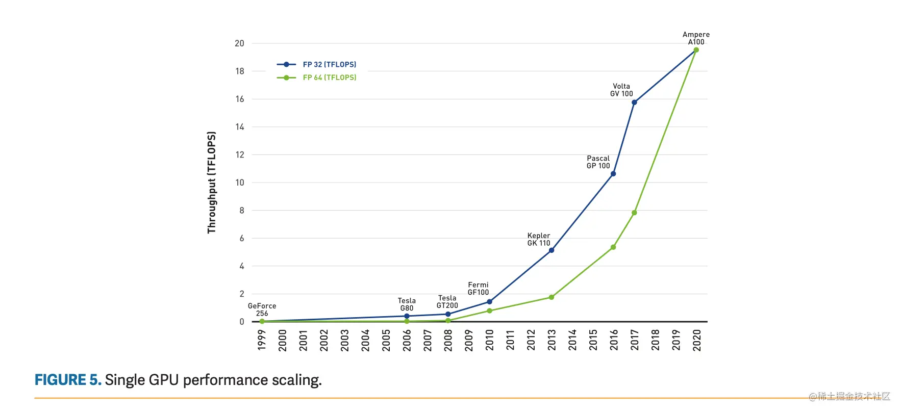
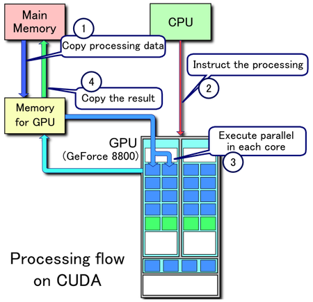

## 一，GPU的Hello world: 矩阵相乘
英伟达GPU架构发展史如下所示:

矩阵相乘程序是GPU编程的 Hello World 程序。编写GPU程序，实质上是一种 `CPU` 和 `GPU` 之间的“互动”，即所谓的异构开发。

### 1.1，GPU编程的一些名词定义

`GPU`编程会涉及到一些名词概念:
- `Host`: 代表 CPU。
- `Device`: 代表 GPU。
- `Host memory`: RAM 内存。
- `Device memory`: GPU上 的存储。
- `Kernal function`: GPU 函数，执行在 device 上面，调用者是 host。
- `Device function`: GPU 函数，执行在 device 上面，调用者是 kernal function 或者 device function。

### 1.2，GPU程序的执行流程

下图可视化了 `GPU` 程序的流程:

1. 把数据从 host memory 拷贝到 device memory上。
2. 配置 `kernal function` 的参数，参数有两种：一种用中括号[ ]，一种用小括号( )。中括号的参数是 threadperblock 和 blockpergrid；小括号就是那种普通函数的参数。
3. 几千个线程同时调用同一个 kernal function(CUDA 的核函数)，在 GPU 里面进行计算。（`kernal function` 的编写，是一门技术。）
4. 把 GPU 里面的运算结果，从 `device memory` 拷贝回 `host memory`。THE END。

## 参考资料

1. [github-CUDA 基础](https://github.com/Tony-Tan/CUDA_Freshman)
2. [知乎专栏-CUDA编程入门](https://www.zhihu.com/column/c_1188568938097819648)
3. [《CUDA C Programming Guide》(《CUDA C 编程指南》)导读](https://zhuanlan.zhihu.com/p/53773183)
4. [CSDN专栏-NVIDIA CUDA 并行编程](https://blog.csdn.net/sunmc1204953974/category_6156113.html)
5. [英伟达GPU架构演进近十年，从费米到安培](https://zhuanlan.zhihu.com/p/413145211)
6. [NVIDIA CUDA C++ Programming Guide](https://docs.nvidia.com/cuda/cuda-c-programming-guide/index.html)