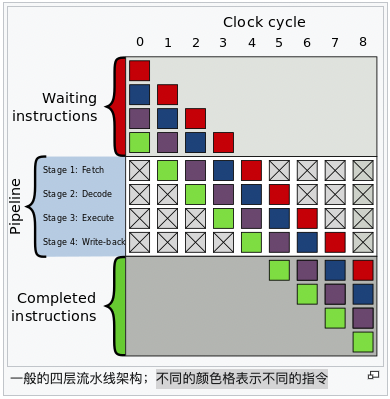
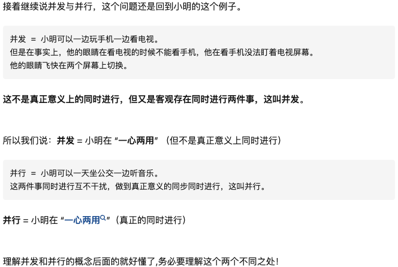

- [一，什么是处理器](#一什么是处理器)
- [二，指令集基础](#二指令集基础)
  - [什么是 ISA](#什么是-isa)
  - [ISA 功能](#isa-功能)
- [三，CPU 设计与实现](#三cpu-设计与实现)
  - [整数范围](#整数范围)
  - [时钟频率](#时钟频率)
  - [指令周期（Instruction cycle）](#指令周期instruction-cycle)
  - [指令流水线（Instruction pipeline）](#指令流水线instruction-pipeline)
  - [指令并行（Instruction-level parallelism）](#指令并行instruction-level-parallelism)
  - [数据并行（Data parallelism）：](#数据并行data-parallelism)
  - [并发与并行](#并发与并行)
  - [线程级并行(Thread-Lever Parallelism)](#线程级并行thread-lever-parallelism)
  - [性能](#性能)
- [参考资料](#参考资料)

> 本文的知识点比较零散，主要是关于处理器的一些基本知识，大部分内容来源于参考资料并给出了自己的理解和整理。

## 一，什么是处理器

先描述下一般处理器的概念，[维基百科](https://en.wikipedia.org/wiki/Processor_(computing))的定义是 “In computing, a processor is an electronic circuit which performs operations on some external data source, usually memory or some other data stream”。最为常见的处理器有 `CPU`（可以运行任何程序）、`GPU`（图形图像处理）和 `DSP`(处理数字信号)，还有专门用来做 `DNN` 应用神经网络处理器。
> 处理器或处理单元是对外部数据源（通常是内存或其他数据流）执行操作的电子组件（数字电路）。

`CPU` 的主要运作原理，不论其外观，都是执行储存于被称为程序里的一系列指令。在此讨论的是遵循普遍的冯·诺伊曼结构（von Neumann architecture）设计的设备。程序以一系列数字储存在计算机存储器中。差不多所有的冯·诺伊曼 `CPU` 的运作原理可分为四个阶段：**提取、解码、执行和写回**。

而专用处理器就是针对**特定应用或者领域**的处理器，类似于是我们经常说的 Domain Specific Architecture 的概念。

## 二，指令集基础

### 什么是 ISA

指令集(`Instruction Set Architecture`, `ISA`)是计算机抽象模型的一部分，它定义了软件如何控制 `CPU`。`ISA` 充当硬件和软件的接口，指示了处理器能够实现什么功能以及如何实现。简单来说，`ISA` 就是传统上软件和硬件的分界线，是用户和硬件交互的唯一方式。

`ISA` 定义了硬件支持的数据类型、寄存器、硬件如何管理内存、关键特性（如虚拟内存）、微处理器可以执行哪些指令，以及多个 ISA 实现的输入输出模型。ISA 可以通过添加指令或其他功能或通过添加对更大地址和数据值的支持来扩展。
> 来源 [What is Instruction Set Architecture (ISA)? - Arm](https://www.arm.com/glossary/isa)

### ISA 功能

大多数 `ISA`（典型如 `x86`-Intel CPU 的指令集），将程序的行为描述成每条指令都是顺序执行的，一条指令结束后，下一条在开始。

`ISA` 提供的主要指令可以分为四大类功能：
1. 执行运算或处理的功能，比如算术操作指令；
2. 控制程序流，比如循环、判断分支和跳转指令；
3. 实现数据搬移，如内存到寄存器，寄存器之间数据搬移等指令；
4. 最后就是一些辅助指令，如 `debug`、中断和 `cache` 之类的指令。

## 三，CPU 设计与实现

### 整数范围

`CPU` 数字表示方法是一个设计上的选择，这个选择影响了设备的工作方式。一些早期的数字计算机内部使用电气模型来表示通用的十进制（基于 `10`进位）记数系统数字。还有一些罕见的计算机使用三进制表示数字。几乎所有的现代的 `CPU` **使用二进制系统来表示数字**，这样数字可以用具有两个值的物理量来表示，例如高低电平等等。

### 时钟频率

主频＝外频×倍频。大部分的 `CPU`，甚至大部分的时序逻辑设备，本质上都是同步的，即它们被设计和使用的前题是假设都在同一个同步信号中工作。

### 指令周期（Instruction cycle）

指令周期是指 **CPU 要执行一条机器指令经过的步骤，由若干机器周期组成**。一般会经历“取指”，“译码”，“发射/执行”和“写回”这些操作。处理器执行程序的过程就是不断重复这几个操作。

### 指令流水线（Instruction pipeline）
> 在1978年的 Intel 8086 处理器都只能一次执行单指令。 Intel首次在486芯片中开始使用，原理是：当指令之间不存在相关时，它们在流水线中是可以重叠起来并行执行。

当一条指令，完成了“取指”操作，开始进行“译码”的时候，取指模块就可以取程序的下一条指令了，这样可以让这些模块不至于闲着没用，即**指令流水线可以两个以上的指令同时执行**(类似车间流水线)。一般的四层流水线架构如下图所示，**不同的颜色格表示不同的指令**。

### 指令并行（Instruction-level parallelism）

同时执行多条指令。比如，一边从 `memory` 读数据，一边进行 `fft` 处理。我们经常听到的超标量（`Superscalar`），超长指令字（`VLIW`），乱序执行（ `Out-of-order execution`）等等技术都是发掘指令级并行的技术。

### 数据并行（Data parallelism）：

一个人指令同时处理多个数据。我们常听到的向量处理器（`vector procesor`），张量处理器（`Tensor processor`）多数都是利用了 `SIMD`（**一条指令可以处理多个数据**，比如一个向量乘法）技术。

### 并发与并行

并发与并行的通俗理解参考[知乎问答-指令级并行，线程级并行，数据级并行区别？线程的概念是什么？](https://www.zhihu.com/question/21823699/answer/111606716)如下：

### 线程级并行(Thread-Lever Parallelism)

线程级并行主要由下面两种技术的支撑：
1. **超线程技术**：2004年，奔腾4实现了Hyper-Threading.（单核心双线程）
2. **多核技术-物理核心**:  2005年，英特尔宣布他的第一个双核心 EM64T 处理器，和 Pentium D840
> 超线程技术实现了单个物理核心同时两个线程，也就是别人常说的虚拟内核数。比如单物理核心实现的双线程，它同时可以处理两个线程，它的物理核心数其实是是1个，通过Hyperthreading技术实现的线程级并行(Thread Lever Parallelism)。至于技术细节的实现，这涉及到高速缓存的知识。

**线程级并行的好处**:
- 当运行多任务时，它减少了之前的操作系统模拟出来的并发，那么用户进行多任务处理时可以运行更多的程序进行并发了。
- 它可以使单个程序运行更快。（仅当该程序有大量线程可以并行处理时）

> 虽然在 1960 年代已经通过操作系统已经实现了线程级并发, 但这种频繁的上下文切换意味损失了 `CPU` 的处理效率。

### 性能

`CPU` 的性能和速度取决于**时钟频率**（一般以赫兹或十亿赫兹计算，即 `hz` 与 `Ghz`）和**每周期可处理的指令**（`IPC`），两者合并起来就是每秒可处理的指令（`IPS`）。`IPS` 值代表了 `CPU` 在几种人工指令序列下“高峰期”的执行率，指示和应用。
## 参考资料

1. 深入理解计算机系统-第三版
2. [专用处理器设计](https://mp.weixin.qq.com/s?__biz=MzI3MDQ2MjA3OA==&mid=2247484980&idx=1&sn=0d1b15f17b1b02bda1bf4d81fd6a01ad&chksm=ead1fb25dda672334c3d72a6d958b2a2b3202c2c5dc9d221df6367ef4dec1023e5f079ae5742&scene=178&cur_album_id=1678711252069466118#rd)
3. https://www.zhihu.com/question/21823699/answer/111606716