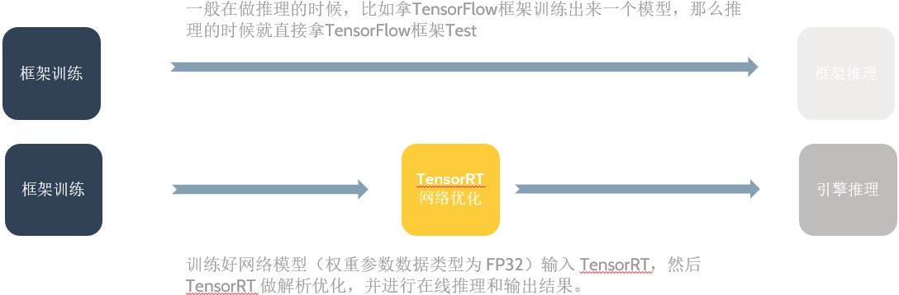
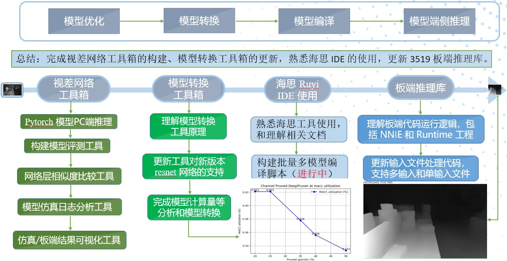

# 模型压缩部署概述
- [模型压缩部署概述](#模型压缩部署概述)
	- [一，模型在线部署](#一模型在线部署)
		- [1.1，深度学习项目开发流程](#11深度学习项目开发流程)
		- [1.2，模型训练和推理的不同](#12模型训练和推理的不同)
	- [二，手机端CPU推理框架的优化](#二手机端cpu推理框架的优化)
	- [三，参考资料](#三参考资料)

## 一，模型在线部署

深度学习和计算机视觉方向除了算法训练/研究，还有两个重要的方向: 模型压缩（模型优化、量化）、模型部署（模型转换、后端功能SDK开发）。所谓模型部署，即将算法研究员训练出的模型部署到具体的**端边云**芯片平台上，并完成特定业务的视频结构化应用开发。

现阶段的平台主要分为云平台（如英伟达 `GPU`）、手机移动端平台（`ARM` 系列芯片）和其他嵌入式端侧平台（海思 `3519`、安霸 `CV22`、地平线 `X3`、英伟达 `jetson tx2` 等芯片）。对于模型部署/移植/优化工程师来说，虽然模型优化、量化等是更有挑战性和技术性的知识，但是对于新手的我们往往是在做解决模型无法在端侧部署的问题，包括但不限于：实现新 `OP`、修改不兼容的属性、修改不兼容的权重形状、学习不同芯片平台的推理部署框架等。对于模型转换来说，现在行业主流是使用 `Caffe` 和 `ONNX` 模型作为中间模型。

### 1.1，深度学习项目开发流程

在高校做深度学习 `demo` 应用一般是这样一个过程，比如使用 `Pytorch/TensorFlow` 框架训练出一个模型，然后直接使用 `Pytorch` 框架做推理（`test`）完成功能验证，但是在工业界这是不可能的，因为这样模型推理速度很慢，一般我们必须有专门的深度学习推理加速框架去做模型推理（`inference`）。以 GPU 云平台推理框架 `TensorRT` 为例，简单描述模型训练推理过程就是：训练好网络模型（权重参数数据类型为 `FP32`）输入 `TensorRT`，然后 `TensorRT` 做解析优化，并进行在线推理和输出结果。两种不同的模型训练推理过程对比如下图所示:

前面的描述较为简单，实际在工业届，理想的深度学习项目开发流程应该分为三个步骤: **模型离线训练、模型压缩和模型在线部署**，后面两个步骤互有交叉，具体详情如下：

1. **模型离线训练**：实时性低，数据离线且更新不频繁，`batchsize` 较大，消耗大量 GPU 资源。
    + 设计开发模型网络结构;
    + 准备数据集并进行数据预处理、`EDA` 等操作；
    + 深度学习框架训练模型：数据增强、超参数调整、优化器选择、训练策略调整（多尺度训练）、`TTA`、模型融合等；
    + 模型测试。

2. **模型优化压缩**：主要涉及模型优化、模型转换、模型量化和模型编译优化，这些过程很多都在高性能计算推理框架中集成了，各个芯片厂商也提供了相应的工具链和推理库来完成模型优化压缩。实际开发中，在不同的平台选择不同的推理加速引擎框架，比如 `GPU` 平台选择 `TensorRT`，手机移动端（`ARM`）选择 `NCNN/MNN`，`NPU` 芯片平台，如海思3519、地平线X3、安霸CV22等则直接在厂商给出的工具链进行模型的优化（`optimizer`）和压缩。
    + **模型优化** `Optimizer`：主要指计算图优化。首先对计算图进行分析并应用一系列**与硬件无关的优化策略**，从而在逻辑上降低运行时的开销，常见的类似优化策略其包括：算子融合（`conv、bn、relu` 融合）、算子替换、常数折叠、公共子表达式消除等。
    + **模型转换** `Converter`：`Pytorch->Caffe`、`Pytorch->ONNX`、`ONNX`模型->`NCNN/NPU芯片厂商模型格式`（需要踩坑非常多，`Pytorch`、`ONNX`、`NPU` 三者之间的算子要注意兼容）。注意 `ONNX` 一般用作训练框架和推理框架之间转换的中间模型格式。
    + **模型量化** `Quantizer`：主要指训练后量化（Post-training quantization `PTQ`）；权重、激活使用不同的量化位宽，如速度最快的量化方式 `w8a8`、速度和精度平衡的量化方式 `w8a16`。
    + **模型编译优化**（编译优化+`NPU` 指令生成+内存优化）`Compiler`：**模型编译针对不同的硬件平台有不同优化方法**，与前面的和硬件无关的模型层面的优化不同。`GPU`平台存在 `kernel fusion` 方法；而 `NPU` 平台算子是通过特定二进制指令实现，其编译优化方法包括，卷积层的拆分、卷积核权重数据重排、`NPU` 算子调优等。

3. **模型部署/SDK输出**: 针对视频级应用需要输出功能接口的SDK。实时性要求高，数据线上且更新频繁，`batchsize` 为 1。主要需要完成多模型的集成、模型输入的预处理、非DL算法模块的开发、 各个模块 `pipeline` 的串联，以及最后 `c` 接口（`SDK`）的输出。
    + **板端框架模型推理**: `Inference`：`C/C++`。不同的 `NPU` 芯片/不同的公司有着不同的推理框架，但是模型的推理流程大致是一样的。包括：输入图像数据预处理、加载模型文件并解析、填充输入图像和模型权重数据到相应地址、模型推理、释放模型资源。这里主要需要学习不同的模型部署和推理框架。
    + **pipeline 应用开发**: 在实际的深度学习项目开发过程中，模型推理只是其中的基础功能，具体的我们还需要实现多模型的集成、模型输入前处理、以及非 `DL` 算法模块的开发: 包括检测模块、跟踪模块、选帧模块、关联模块和业务算法模块等，并将各模块串联成一个 `pipeline`，从而完成视频结构化应用的开发。
    + **SDK集成**: 在完成了具体业务 `pipeline` 的算法开发后，一般就需要输出 `c` 接口的 `SDK` 给到下层的业务侧（前后端）人员调用了。这里主要涉及 `c/c++` 接口的转换、`pipeline` 多线程/多通道等sample的开发、以及大量的单元、性能、精度、稳定性测试。
    + **芯片平台板端推理** `Inference`，不同的 `NPU` 芯片有着不同的 `SDK` 库代码，但是模型运行流程类似。

> 不同平台的模型的编译优化是不同的，比如 `NPU` 和一般 `GPU` 的区别在于后端模型编译上，`GPU` 是编译生成 `kernel library`(`cuDNN` 函数)，`NPU` 是编译生成二进制指令；前端的计算图优化没有本质区别，基本通用。

所以综上所述，深度学习项目开发流程可以大致总结为三个步骤: **模型离线训练**、**模型优化压缩**和**模型部署/SDK输出**，后两个步骤互有交叉。前面 `2` 个步骤在 `PC` 上完成，最后一个步骤开发的代码是需要在在 `AI` 芯片系统上运行的。最后以视差模型在海思 `3519` 平台的部署为例，其模型部署工作流程如下：

### 1.2，模型训练和推理的不同

为了更好进行模型优化和部署的工作，需要总结一下模型推理（`Inference`）和训练（`Training`）的不同：

1. 网络权重值固定，只有前向传播（`Forward`），无需反向传播，因此：
    + 模型权值和结构固定，可以做计算图优化，比如算子融合等；
    + 输入输出大小固定，可以做 `memory` 优化，比如 `feature` 重排和 `kernel` 重排。
2. `batch_size` 会很小（比如 `1`），存在 `latency` 的问题。
3. 可以使用低精度的技术，训练阶段要进行反向传播，每次梯度的更新是很微小的，需要相对较高的精度比如 `FP32` 来处理数据。但是推理阶段，对精度要求没那么高，现在很多论文都表明使用低精度如 `in16` 或者 `int8` 数据类型来做推理，也不会带来很大的精度损失。

## 二，手机端CPU推理框架的优化

对于 `HPC` 和软件工程师来说，在手机 `CPU` 端做模型推理框架的优化，可以从上到下考虑：

1. **算法层优化**：最上面就是算法层，如可以用winograd从数学上减少乘法的数量（仅在大channel尺寸下有效）；
2. **框架优化**：推理框架可以实现内存池、多线程等策略；
3. **硬件层优化**：主要包括: 适应不同的硬件架构特性、`pipeline`和`cache`优化、内存数据重排、`NEON` 汇编优化等。

## 三，参考资料

1. 《NVIDIA TensorRT 以及实战记录》PPT
