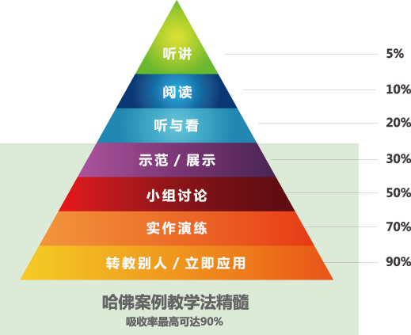
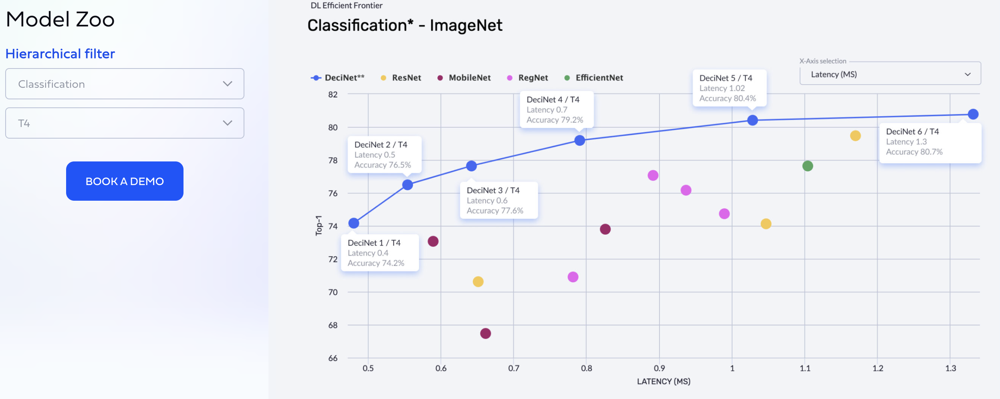
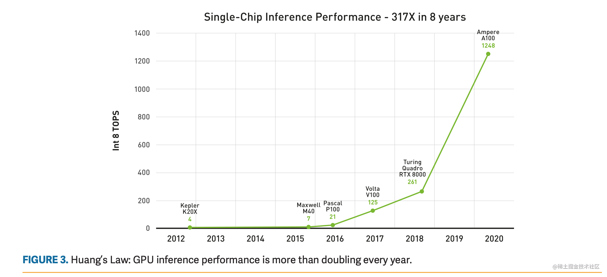

- [前言](#前言)
- [一，计算机系统](#一计算机系统)
  - [1.1，计算机系统书籍](#11计算机系统书籍)
  - [1.2，设计模式教程](#12设计模式教程)
- [二，编程语言](#二编程语言)
  - [2.1，C++ 学习资料](#21c-学习资料)
  - [2.2，Python 学习资料](#22python-学习资料)
- [三，数据结构与算法](#三数据结构与算法)
  - [3.1，数据结构与算法课程](#31数据结构与算法课程)
  - [3.2，算法题解](#32算法题解)
- [四，机器学习](#四机器学习)
  - [4.1，机器学习课程](#41机器学习课程)
- [五，深度学习](#五深度学习)
  - [5.1，深度学习课程](#51深度学习课程)
  - [5.2，深度学习基础文章](#52深度学习基础文章)
  - [5.3，经典CNN分析文章](#53经典cnn分析文章)
  - [5.4，PyTorch 框架学习文章](#54pytorch-框架学习文章)
  - [5.5，PyTorch/Caffe 框架分析文章](#55pytorchcaffe-框架分析文章)
- [六，计算机视觉](#六计算机视觉)
  - [6.1，数字图像处理教程](#61数字图像处理教程)
  - [6.2，计算机视觉基础课程](#62计算机视觉基础课程)
  - [6.3，深度学习模型和资源库](#63深度学习模型和资源库)
  - [6.4，目标检测网络文章](#64目标检测网络文章)
  - [6.5，语义分割文章](#65语义分割文章)
  - [6.6，3D 视觉技术文章](#663d-视觉技术文章)
  - [6.7，深度学习的评价指标文章](#67深度学习的评价指标文章)
- [七，模型压缩与量化](#七模型压缩与量化)
  - [7.1，轻量级网络设计](#71轻量级网络设计)
  - [7.2，模型压缩文章](#72模型压缩文章)
  - [7.3，神经网络量化文章](#73神经网络量化文章)
  - [7.4，推理框架剖析文章](#74推理框架剖析文章)
- [八，高性能计算](#八高性能计算)
  - [8.1，CPU/GPU/AI 芯片科普](#81cpugpuai-芯片科普)
  - [8.2，指令集(ISA)学习资料](#82指令集isa学习资料)
  - [8.3，矩阵乘优化文章](#83矩阵乘优化文章)
- [九，模型部署(算法SDK开发)](#九模型部署算法sdk开发)
  - [9.1，模型部署文章](#91模型部署文章)
- [博客阅读后的知识点总结](#博客阅读后的知识点总结)
- [参考资料](#参考资料)
> 文章同步发于 [github 仓库](https://github.com/HarleysZhang/cv_note/blob/master/6-computer_vision/cv%E7%AE%97%E6%B3%95%E5%B7%A5%E7%A8%8B%E5%B8%88%E5%AD%A6%E4%B9%A0%E6%95%99%E7%A8%8B.md)和 [csdn 博客](http://t.csdn.cn/jDT39)，**最新版以 `github` 为主**。如果看完文章有所收获，一定要先点赞后收藏。毕竟，赠人玫瑰，手有余香.
> 更多干货文章和面经，点击查看我的公众号-嵌入式视觉，扫码关注我的公众号!

本文内容为 `cv` 算法工程师成长子路上的经典学习教材汇总，对于一些新兴领域则给出了较好的博客文章链接。本文列出的知识点目录是**成系统且由浅至深**的，可作为 `cv` 算法工程师的**常备学习路线资料**。部分学习资料存在离线 `PDF` 电子版，其可在 [github仓库-cv_books](https://github.com/HarleysZhang/cv-books) 中下载。

## 前言

**课程学习方法**，三句话总结：

- 看授课视频形成概念，发现个人感兴趣方向。
- 读课程笔记理解细节，夯实工程实现的基础。
- 码课程作业实现算法，积累实验技巧与经验。

再引用一下学习金字塔的图：

> 来源 `github` 仓库[DeepLearning Tutorial](https://github.com/Mikoto10032/DeepLearning)

关于科研和研发的思考，可参考文章-[中国人民大学赵鑫：AI 科研入坑指南](https://mp.weixin.qq.com/s/UH7UIq7ajwpdR6fZ9CfG6Q)。

## 一，计算机系统

### 1.1，计算机系统书籍

1. 《深入理解计算机系统第三版》： 网上有电子版，`PDF` 电子书下载方式在文章首页。

### 1.2，设计模式教程

1. [设计模式](https://refactoringguru.cn/design-patterns/catalog)： 内容很全，存在 `C++` 示例代码。

## 二，编程语言

### 2.1，C++ 学习资料

1. [cpp reference](https://en.cppreference.com/w/): c++ 库接口参考标准文档，官方文档，包含各个函数定义及使用 `example`。
2. [http://www.cplusplus.com/reference/stl/](http://www.cplusplus.com/reference/stl/ "http://www.cplusplus.com/reference/stl/")
3. [Cpp Primer 学习](https://github.com/applenob/Cpp_Primer_Practice): 《C++ Primer 中文版（第 5 版）》学习仓库，包括笔记和课后练习答案。
4. [C++ Tips of the Week](https://abseil.io/tips/): 谷歌出品的 `C++` 编程技巧。

### 2.2，Python 学习资料

1. [《廖雪峰-Python3教程》](https://www.liaoxuefeng.com/wiki/1016959663602400): 内容很全且通俗易懂，适合初学者，但代码示例不够丰富。描述的知识点有：Python 基础、函数、高级特性、函数式编程、模块、面向对象编程、面向对象高级编程、错误、调试和测试、IO 编程、进程和线程、正则表达式、常用内建模块、常用第三方模块、图形界面、网络编程、异步IO 等内容。电子书可在[github仓库-cv_books](https://github.com/HarleysZhang/cv-books) 中下载。
2. [Python 工匠系列文章](https://github.com/piglei/one-python-craftsman): 很适合**深入理解** Python 面向对象编程、装饰器、模块、异常处理等内容。
## 三，数据结构与算法

### 3.1，数据结构与算法课程
1. 《图解算法》：存在 PDF 电子版，内容较为基础且通俗易懂，适合快速了解数据结构与算法的基础知识，但深度不够，示例代码为 `Python`。
1. [专栏-数据结构与算法之美](https://time.geekbang.org/column/intro/126): 学习数据结构与算法的知识点课程，**内容全且深度足够**。官方例子为 `java` 代码，同时 `github` 仓库提供 `C/C++/GO/Python` 等代码。

### 3.2，算法题解
2. [《剑指Offer》面试题: Python实现](https://github.com/JushuangQiao/Python-Offer): 题目为《剑指Offer》书籍原题，代码实现为 `Python`，仓库简洁，阅读体验不错，无任何广告，适合刚学完数据结构与算法基础知识的同学。
3. [力扣++-算法图解](https://leetcode-solution-leetcode-pp.gitbook.io/leetcode-solution/): `leetcode` 高频题图解，题解分析很多，部分题目有动画分析，提供 `Python/Java/C++` 实现，但也存在部分题解分析废话较多，不够精简的问题。
4. [小浩算法](https://www.geekxh.com/): 一部图解算法题典，讲解 105 道高频面试算法题目，`go` 代码实现。
5. [LeetCode题解](https://algorithm-essentials.soulmachine.me/): leetcode 高频题题解，全书代码默认使用 `C++11` 语法编写，题解为文字性描述，题解分析较短且不够通俗易懂。本书的目标读者是准备去硅谷找工作的码农，也适用于在国内找工作的码农，以及刚接触 ACM 算法竞赛的新手。

## 四，机器学习

### 4.1，机器学习课程
1. 《机器学习》-周志华（西瓜书）：存在 `PDF` 电子版，内容很全，**很适合打下扎实的基础**。
2. [《李宏毅-机器学习课程》](http://speech.ee.ntu.edu.tw/~tlkagk/talk.html): **机器学习经典视频教程**啊，非常适合初学者观看。
3. [李宏毅机器学习笔记(LeeML-Notes)](https://github.com/datawhalechina/leeml-notes): 可以在线阅读，很方便，内容完成度高。
4. [《南瓜书PumpkinBook》](https://github.com/datawhalechina/pumpkin-book): 南瓜书，是西瓜书的补充资料，**包含了西瓜书的公式的详细推导**，建议先看西瓜书，部分公式不会推导的情况下，可以查看南瓜书的对应内容。
5. [机器学习数学基础](https://github.com/fengdu78/Data-Science-Notes/blob/master/0.math/1.CS229/2.CS229-Prob.pdf): 黄海广博士翻译的 `CS229` 机器学习课程的线性代数基础材料，英文好的建议看原版。

## 五，深度学习

### 5.1，深度学习课程
1. 《深度学习》（花书），存在英文和中文 `PDF` 电子版，内容成系统，覆盖了深度学习的方方面面，强烈建议至少看完跟自己方向相关的章节，有利于打好扎实的基础。
2. [《李宏毅-深度学习课程》](https://speech.ee.ntu.edu.tw/~hylee/ml/2021-spring.php)： 经典视频教程，实例有趣（皮卡丘），内容讲解由浅至深，李宏毅老师个人官网也提供了视频链接、 `PPT` 课件、代码资料。

### 5.2，深度学习基础文章

1. [CNN中参数解释及计算](https://flat2010.github.io/2018/06/15/%E6%89%8B%E7%AE%97CNN%E4%B8%AD%E7%9A%84%E5%8F%82%E6%95%B0/ "CNN中参数解释及计算")
2. [深度学习推理时融合BN，轻松获得约5%的提速](https://mp.weixin.qq.com/s/P94ACKuoA0YapBKlrgZl3A)
3. [动图形象理解深度学习卷积](https://mp.weixin.qq.com/s/aJ7AioWLoox7WBFPYa_nCQ)

### 5.3，经典CNN分析文章

1. [深度可分离卷积（Xception 与 MobileNet 的点滴）](https://www.jianshu.com/p/38dc74d12fcf?utm_source=oschina-app "深度可分离卷积（Xception 与 MobileNet 的点滴）")
2. [[DL-架构-ResNet系] 002 ResNet-v2](https://zhuanlan.zhihu.com/p/29678910 "[DL-架构-ResNet系] 002 ResNet-v2")
3. [ResNet及其变种的结构梳理、有效性分析与代码解读](https://zhuanlan.zhihu.com/p/54289848 "ResNet及其变种的结构梳理、有效性分析与代码解读")

> 1，VGGNet 拥有 5 段 卷积，每一段有 2~3 个卷积层，同时每段尾部会连接一个最大池化层用来缩小图片尺寸，每段内的卷积核数量相同，越靠后的段的卷积核数量越多：64-128-256-512-512。ResNet 网络拥有 4 段卷积， 每段卷积代表一个 残差学习 `Blocks`，根据网络层数的不同， Blocks 的单元数量不同，例如 ResNet18 的 Blocks 单元数量分别为2、2、2 和 2。越靠后的段的卷积核数量越多：64-128-256-512，残差学习 `Blocks` 内的卷积核通道数是相同的。

> 2，ResNet v2 创新点在于通过理论分析和实验证明恒等映射对于残差块的重要性，根据激活函数与相加操作的位置关系，我们称之前的组合方式（ResNet）为“后激活（post-activation）”，现在新的组合方式（ResNet v2）称之为“预激活（pre-activation）”。使用预激活有两个方面的优点：1)`f` 变为恒等映射，使得网络更易于优化；2)使用 `BN` 作为预激活可以加强对模型的正则化。

### 5.4，PyTorch 框架学习文章

1. [PyTorch中文文档](https://pytorch-cn.readthedocs.io/zh/latest/)；[PyTorch官方教程中文版](https://pytorch123.com/)；[PyTorch 官方教程](https://pytorch.org/tutorials/)。
2. [PyTorch_tutorial_0.0.5_余霆嵩](https://github.com/TingsongYu/PyTorch_Tutorial/blob/master/Data/PyTorch_tutorial_0.0.5_%E4%BD%99%E9%9C%86%E5%B5%A9.pdf): 存在开源 `PDF` 电子版，且提供较为清晰的代码，**适合快速入门，教程目录结构清晰明了**。

### 5.5，PyTorch/Caffe 框架分析文章
1. [pytorch自定义层如何实现？超简单！](https://zhuanlan.zhihu.com/p/144904949 "pytorch自定义层如何实现？超简单！")
2. [【PyTorch】torch.nn.Module 源码分析](https://zhuanlan.zhihu.com/p/88712978 "【PyTorch】torch.nn.Module 源码分析")
3. [详解Pytorch中的网络构造，模型save和load，.pth权重文件解析](https://www.cnblogs.com/hansjorn/p/11467081.html "详解Pytorch中的网络构造，模型save和load，.pth权重文件解析")
4. [半小时学会 PyTorch Hook](https://zhuanlan.zhihu.com/p/75054200 "半小时学会 PyTorch Hook")
5. [详解Pytorch中的网络构造](https://zhuanlan.zhihu.com/p/53927068 "详解Pytorch中的网络构造")
6. [深度学习与Pytorch入门实战（九）卷积神经网络&Batch Norm](https://www.cnblogs.com/douzujun/p/13352640.html "深度学习与Pytorch入门实战（九）卷积神经网络&Batch Norm")
7.  [Pytorch 里 nn.AdaptiveAvgPool2d(output_size) 原理是什么?](https://www.zhihu.com/question/282046628 "Pytorch 里 nn.AdaptiveAvgPool2d(output_size) 原理是什么?")
8.  [caffe源码解析-开篇](https://zhuanlan.zhihu.com/p/25127756 "caffe源码解析-开篇")
9.  《Caffe官方教程中译本》：存在开源 `PDF` 电子版。
## 六，计算机视觉

### 6.1，数字图像处理教程

1. 《数字图像处理第四版》：存在开源 `PDF` 电子版。成系统的介绍了数字图像的原理及应用，**内容多且全、深度也足够**，非常适合深入理解数学图像原理，可挑重点看。
2. [桔子code-OpenCV-Python教程](http://www.juzicode.com/opencvpythontutorial/)

### 6.2，计算机视觉基础课程
1. 《CS231 课程》-李飞飞。[b 站视频教程](https://www.bilibili.com/video/BV1nJ411z7fe/)，[CS231n官方笔记授权翻译总集](https://zhuanlan.zhihu.com/p/21930884)。**课程非常经典，内容深入浅出**，每节课都有课后作业和对应学习笔记。
2. 《动手学深度学习》-李沐，存在开源 `PDF` 电子书，官方代码为 `MXNet` 框架，也存在 `PyTorch` 代码实现书籍。
3. 《解析卷积神经网络-深度学习实践手册》-魏秀参：对 `CNN` 对基础部件做了深入描述，本书内容全且成系统，适合想深入学习 `CNN` 的同学，唯一的缺点没有项目案例以供实践。本书提供开源 `PDF` 电子版。
### 6.3，深度学习模型和资源库

1. [Papers With Code](https://paperswithcode.com/)
2. [Jetson Zoo](https://developer.nvidia.com/embedded/community/jetson-projects#fruit_quality_control)
3. [ModelZOO](https://modelzoo.co/)
4. [MediaPipe 框架](https://google.github.io/mediapipe/)
5. [Deci's Hardware Aware Model](https://deci.ai/)

> 1. `Papers with code` 是由 `Meta AI Research` 团队主导的一个开放资源的社区，汇集了深度学习论文、数据集、算法代码、模型以及评估表。
> 2. `Jetson Zoo`，是一个开源目录，其中包含在 `NVIDIA Jetson` 硬件平台上开发指南以及**参考案例**分享汇总。模型库资源里包括图像分类、目标检测、语义分割和姿势估计等方向的实践分享，提供**开源代码**和开发指南文章的链接。
> 3. `Model Zoo` 包含了机器学习各领域的算法框架及预训练模型资源汇总，其中包括 `TensorFlow`、`PyTorch`、`Keras`、`Caffe`等框架，作者是 `Google` 的机器学习研究员的`Jing Yu Koh`构建。
> 4. MediaPipe 是一个为直播和流媒体提供跨平台、可定制的机器学习解决方案的框架。MediaPipe 提供了包括人脸检测、人脸网格、虹膜识别、手部关键点检测、人体姿态估计、人体+人脸+手部组合整体、头发分割、目标检测、Box 跟踪、即时运动追踪、3D 目标检测等解决方案。
> 5. `Deci` 旨在使用 `AI` 构建更好的 `AI`，使深度学习能够发挥其真正的潜力。借助该公司的**端到端深度学习加速平台**，人工智能开发人员可以为任何环境（包括**云、边缘或移动**）构建、优化和部署更快、更准确的模型。借助 `Deci` 的平台，开发人员可以在任何硬件上将深度学习模型推理性能提高 `3` 到 `15` 倍，同时仍然保持准确性。平台除了能够显示每个模型的准确性之外，还可以轻松选择目标推理硬件并查看模型的运行时性能结果，例如各种硬件的**吞吐量、延迟、模型大小和内存占用**。但是模型加速模块的 `demo` 是需要注册账户和购买的。

### 6.4，目标检测网络文章

1. [一文读懂Faster RCNN](https://zhuanlan.zhihu.com/p/31426458 "一文读懂Faster RCNN")
2. [从编程实现角度学习Faster R-CNN（附极简实现）](https://zhuanlan.zhihu.com/p/32404424 "从编程实现角度学习Faster R-CNN（附极简实现）")
3. [Mask RCNN学习笔记](https://www.cnblogs.com/wangyong/p/10614898.html "Mask RCNN学习笔记")
4. [Mask RCNN 源代码解析 (1) - 整体思路](https://blog.csdn.net/hnshahao/article/details/81231211 "Mask RCNN 源代码解析 (1) - 整体思路")
5. [物体检测之Focal Loss及RetinaNet](https://zhuanlan.zhihu.com/p/48958966 "物体检测之Focal Loss及RetinaNet")
6. [CVPR18 Detection文章选介（下）](https://zhuanlan.zhihu.com/p/36431183 "CVPR18 Detection文章选介（下）")
7. [2020首届海洋目标智能感知国际挑战赛 冠军方案分享](https://mp.weixin.qq.com/s/uUIJBxM0PATHSRxDbWbyTg)
8. [目标检测中的样本不平衡处理方法——OHEM, Focal Loss, GHM, PISA](https://ranmaosong.github.io/2019/07/20/cv-imbalance-between-easy-and-hard-examples/ "目标检测中的样本不平衡处理方法——OHEM, Focal Loss, GHM, PISA")

### 6.5，语义分割文章

1. [2019年最新基于深度学习的语义分割技术讲解](https://mp.weixin.qq.com/s/ektiUl_H_JlUJdaba-NGsw)
2. [U-Net 论文笔记](https://zhuanlan.zhihu.com/p/37496466 "U-Net 论文笔记")

### 6.6，3D 视觉技术文章

1. [3D成像方法 汇总（原理解析）--- 双目视觉、激光三角、结构光、ToF、光场、全息](https://www.eet-china.com/mp/a22843.html "3D成像方法 汇总（原理解析）--- 双目视觉、激光三角、结构光、ToF、光场、全息")
2. [关于双目立体视觉的三大基本算法及发展现状的总结](https://bbs.cvmart.net/topics/3058 "关于双目立体视觉的三大基本算法及发展现状的总结")
3. [3D视觉CV界的终极体现形式，计算机如何「看」这个三维世界](https://mp.weixin.qq.com/s?__biz=MzA3MzI4MjgzMw==&mid=2650803376&idx=3&sn=7d7cca1f447aaee307c1b8aa2e2f6e9f&chksm=84e5c8ceb39241d8b5a7f4e76f1fbc9a7d5284fcce4a6963f82fef6590baff39ab5c6bced5db&scene=132#wechat_redirect)

### 6.7，深度学习的评价指标文章

1. [ROC和AUC介绍以及如何计算AUC](http://alexkong.net/2013/06/introduction-to-auc-and-roc/ "ROC和AUC介绍以及如何计算AUC")
2. [COCO目标检测测评指标](https://www.jianshu.com/p/d7a06a720a2b "COCO目标检测测评指标")
3. [如何评测AI系统？](https://zhuanlan.zhihu.com/p/37098055)
4. [PLASTER：一个与深度学习性能有关的框架](https://zhuanlan.zhihu.com/p/38315051)
5. [The Correct Way to Measure Inference Time of Deep Neural Networks](https://towardsdatascience.com/the-correct-way-to-measure-inference-time-of-deep-neural-networks-304a54e5187f)

## 七，模型压缩与量化
### 7.1，轻量级网络设计

1. [轻量卷积神经网络的设计](https://zhuanlan.zhihu.com/p/64400678 "轻量卷积神经网络的设计")
> 网络结构碎片化更多是指网络中的多路径连接，类似于 `short-cut`，`bottle neck` 等不同层特征融合，还有如 `FPN` 等结构。拖慢并行的一个很主要因素是，**运算快的模块总是要等待运算慢的模块执行完毕**。

2. [ShuffleNet V2: Practical Guidelines for Efficient CNN Architecture Design](https://www.cnblogs.com/seniusen/p/12047954.html "ShuffleNet V2: Practical Guidelines for Efficient CNN Architecture Design")
3. [ShufflenetV2_高效网络的4条实用准则](https://zhuanlan.zhihu.com/p/42288448 "ShufflenetV2_高效网络的4条实用准则")
4. [轻量级神经网络：ShuffleNetV2解读](https://www.jiqizhixin.com/articles/2019-06-03-14 "轻量级神经网络：ShuffleNetV2解读")

### 7.2，模型压缩文章

1. [解读模型压缩3：高效模型设计的自动机器学习流水线](https://zhuanlan.zhihu.com/p/299422728)
2. [Deep compression: Compressing deep neural networks with pruning, trained quantization and huffman coding](https://arxiv.org/pdf/1510.00149.pdf)
3. [韩松Deep compression论文讲解——PPT加说明文字](https://blog.csdn.net/weixin_36474809/article/details/80643784)
4. [论文总结 - 模型剪枝 Model Pruning](https://xmfbit.github.io/2018/10/03/paper-summary-model-pruning/)
5. [编译器与IR的思考: LLVM IR，SPIR-V到MLIR](https://mp.weixin.qq.com/s/G36IllLOTXXbc4LagbNH9Q)

### 7.3，神经网络量化文章

1. [神经网络量化简介](https://jackwish.net/2019/neural-network-quantization-introduction-chn.html "神经网络量化简介")
2. [线性量化](https://www.yuque.com/yahei/hey-yahei/quantization.mxnet2 "线性量化")
3. [Int8量化-介绍（一）](https://zhuanlan.zhihu.com/p/58182172 "Int8量化-介绍（一）")
4. [Int8量化-ncnn社区Int8重构之路（三）](https://zhuanlan.zhihu.com/p/61451372 "Int8量化-ncnn社区Int8重构之路（三）")
5. [ncnn源码学习（六）：模型量化原理笔记](https://blog.csdn.net/sinat_31425585/article/details/101607785 "ncnn源码学习（六）：模型量化原理笔记")
6. [神经网络推理加速之模型量化](https://zh.mxnet.io/blog/model-quantization "神经网络推理加速之模型量化")
7. [NNIE 量化感知训练](https://zhuanlan.zhihu.com/p/183176369 "NNIE 量化感知训练")

> 1，量化是指用于执行计算并以低于浮点精度的位宽存储张量的技术，或者说量化就是将神经网络的浮点算法转换为定点。 量化模型对张量使用整数而不是浮点值执行部分或全部运算。

> 2，量化简单来说就是将浮点存储（运算）转换为整型存储（运算）的一种模型压缩技术。

> 3，虽然精心设计的 `MobileNet` 能在保持较小的体积时仍然具有与 `GoogleNet` 相当的准确度，不同大小的 `MobileNet` 本身就表明——也许一个好的模型设计可以改进准确度，但同类模型中仍然是更大的网络，更好的效果!

> 4，权重值域调整是另一个机器学习过程，学习的目标是一对能在量化后更准确地运行网络的超参数 `min/max`。

### 7.4，推理框架剖析文章

1. [优化 TensorFlow Lite 推理运行环境内存占用](https://mp.weixin.qq.com/s/qWLgTKRRhwjLucRegHLcBA)
2. [ncnn源码解析（五）：执行器Extractor](https://blog.csdn.net/sinat_31425585/article/details/100674365?spm=1001.2014.3001.5502)

## 八，高性能计算

### 8.1，CPU/GPU/AI 芯片科普

1. [一文读懂 GPU 的发展历程](https://juejin.cn/post/7125824952342675464 "一文读懂 GPU 的发展历程")
2. [CPU、GPU、NPU等芯片架构、特点研究](https://www.cnblogs.com/liuyufei/p/13259264.html "CPU、GPU、NPU等芯片架构、特点研究")
3. [什么是异构并行计算？CPU与GPU的区别是什么？](http://imgtec.eetrend.com/blog/2019/100046756.html "什么是异构并行计算？CPU与GPU的区别是什么？")
4. [看懂芯片原来这么简单（二）：AI为什么聪明？什么是华为自研架构NPU？](https://mp.weixin.qq.com/s/OfWsbV6OIZ39t3944nUhWg)
5. [【专利解密】如何提高AI资源利用率？ 华为卷积运算芯片](https://aijishu.com/a/1060000000144539 "【专利解密】如何提高AI资源利用率？ 华为卷积运算芯片")
6. [嵌入式系统 内存模块设计](https://jachinshen.github.io/study/2018/03/06/%E5%B5%8C%E5%85%A5%E5%BC%8F%E7%B3%BB%E7%BB%9F-%E5%86%85%E5%AD%98%E6%A8%A1%E5%9D%97%E8%AE%BE%E8%AE%A1.html)

### 8.2，指令集(ISA)学习资料

1. [Intel® Intrinsics Guide](https://www.intel.com/content/www/us/en/docs/intrinsics-guide/index.html#ig_expand=611 "Intel® Intrinsics Guide")
2. [Neon Intrinsics Reference](https://developer.arm.com/architectures/instruction-sets/simd-isas/neon/intrinsics "Neon Intrinsics Reference")
3. [ARM Neon Intrinsics 学习指北：从入门、进阶到学个通透](https://mp.weixin.qq.com/s/E73KW7vxYikpcLYPBf4-HA)
> `Neon` 是 `ARM` 平台的向量化计算指令集，通过一条指令完成多个数据的运算达到加速的目的，或者说 `Neon` 是 ARM 平台的 `SIMD`（Single Instruction Multiple Data，单指令多数据流）指令集实现。常用于AI、多媒体等计算密集型任务。
### 8.3，矩阵乘优化文章

1. [移动端arm cpu优化学习笔记----一步步优化盒子滤波（Box Filter）](https://zhuanlan.zhihu.com/p/64522357)
2. [OpenBLAS gemm从零入门](https://zhuanlan.zhihu.com/p/65436463 "OpenBLAS gemm从零入门")
3. [通用矩阵乘（GEMM）优化算法](https://jackwish.net/2019/gemm-optimization.html "通用矩阵乘（GEMM）优化算法")
4. [卷积神经网络中的Winograd快速卷积算法](https://www.cnblogs.com/shine-lee/p/10906535.html "卷积神经网络中的Winograd快速卷积算法")
5. [知乎专栏-深入浅出GPU优化](https://www.zhihu.com/column/c_1437330196193640448 "知乎专栏-深入浅出GPU优化")
6. [CUDA GEMM 理论性能分析与 kernel 优化](https://zhuanlan.zhihu.com/p/441146275 "CUDA GEMM 理论性能分析与 kernel 优化")
7. [OpenPPL 中的卷积优化技巧](https://zhuanlan.zhihu.com/p/450310581 "OpenPPL 中的卷积优化技巧")：概述总结类文章，无代码，非专注时刻也能阅读。
8. [【张先轶】BLISlab学习优化矩阵乘。第一课](https://www.bilibili.com/video/BV1c94y117Uw/?vd_source=4ab49101e323bf3a37e7b81812524444 "【张先轶】BLISlab学习优化矩阵乘。第一课")
9. [矩阵乘法与 SIMD](https://jcf94.com/2021/08/28/2021-08-28-simd/ "矩阵乘法与 SIMD")
> `Winograd` 是一种快速卷积算法，适用于小卷积核，可以减少浮点乘法的次数。
## 九，模型部署(算法SDK开发)

### 9.1，模型部署文章

1. [海思AI芯片(Hi3519A/3559A)方案学习（二十五）初识 mapper_quant 和mapper_param](https://blog.csdn.net/avideointerfaces/article/details/103070021)
2. [部署PyTorch模型到终端](https://zhuanlan.zhihu.com/p/54665674)
3. [多场景适配，TNN如何优化模型部署的存储与计算](https://www.infoq.cn/article/4rfxdkkvvyb6auxhjxi4)
4. [模型转换、模型压缩、模型加速工具汇总](https://blog.csdn.net/WZZ18191171661/article/details/99700992)
5. [深度学习模型转换与部署那些事(含ONNX格式详细分析)](https://bindog.github.io/blog/2020/03/13/deep-learning-model-convert-and-depoly/)
6. [ONNX初探](https://mp.weixin.qq.com/s/H1tDcmrg0vTcSw9PgpgIIQ)
## 博客阅读后的知识点总结

1，为了尽可能地提高 `MAC阵列` 的利用率以及卷积运算效率，阵列控制模块会根据第一卷积参数矩阵的行数和第一卷积数据阵列的行数来确定第一乘法累加窗口的列数。

2，`SNPE` 开发流程：

3，目标检测模型效果提升方法：

+ 以 `Cascade RCNN` 作为 `baseline`，以 `Res2Net101` 作为 `Backbone`；
+ `Albumentation` 库做数据集增强-用在模型训练中；
+ 多尺度训练(`MST` Multi-scale training/testing)的升级版-`SNIP`方法(Scale Normalization for Image Pyramids)，用在 `baseline` 模型训练和测试中：解决模板大小尺度不一的问题；
+ `DCN` 可变性卷积网络-用在 `baseline` 模型的 `backone` 中；
+ `soft-NMS`：解决目标互相重叠的问题；
+ `HTC` 模型预训练， `Adam` 优化算法可以较好的适应陌生数据集，学习率热身(`warm-up`)来稳定训练过程。

4，`SNIP` 论文解读：

`SNIP` 非常 `solid` 地证明了就算是数据相对充足的情况下，`CNN` 仍然很难使用所有 `scale` 的物体。个人猜测是由于 CNN 中没有对于 scale invariant 的结构，CNN 能检测不同 scale 的“假象”，更多是通过CNN 来通过 `capacity` 来强行 `memorize` 不同 `scale` 的物体来达到的，这其实浪费了大量的 `capacity`，而 `SNIP` 这样只学习同样的 scale 可以保障有限的 capacity 用于学习语义信息。论文的关键贡献：发现现在的 CNN 网络无法很好的解决 scale invariance 的问题，提出了一个治标不治本的方法。

5，高效模型设计（模型压缩）方法：

一般而言，**高效模型**的设计有 6 大基本思路：1）轻量级架构、2）模型裁剪、3）`AutoML` 和 `NAS` 模型搜索、4）低精度量化、5）知识蒸馏、6）高效实现。
> 来源旷世学术分享-[张祥雨：高效轻量级深度模型的研究和实践](https://aijishu.com/a/1060000000090519)。

6，网络深度与宽度的理解及意义

> 更多理解参考知乎[网络宽度对深度学习模型性能有什么影响？](https://www.zhihu.com/question/322219788 "网络宽度对深度学习模型性能有什么影响？")

在一定的程度上，网络越深越宽，性能越好。宽度，即通道(`channel`)的数量，网络深度，及 `layer` 的层数，如 `resnet18` 有 `18` 层网络。注意我们这里说的和宽度学习一类的模型没有关系，而是特指深度卷积神经网络的(通道)宽度。

+ `网络深度的意义`：CNN 的网络层能够对输入图像数据进行逐层抽象，比如第一层学习到了图像边缘特征，第二层学习到了简单形状特征，第三层学习到了目标形状的特征，网络深度增加也提高了模型的抽象能力。
+ `网络宽度的意义`：网络的宽度（通道数）代表了滤波器（`3` 维）的数量，滤波器越多，对目标特征的提取能力越强，即让每一层网络学习到更加丰富的特征，比如不同方向、不同频率的纹理特征等。

7，所有 `Inception` 模型都具有一个重要的性质——都是遵循 拆分-变换-合并（`split-transform-merge`） 的设计策略。

8，对于某种指令，延迟 `latency` 主要关注单条该指令的最小执行时间，吞吐量 `throughout` 主要关注单位时间内系统（一个CPU核）最多执行多少条该指令。因为 AI 计算的数据量比较大，所以更关注吞吐量。

9，`CPU` 高性能通用优化方法包括：
+ 编译选项优化
+ 内存性能和耗电优化：内存复用原则，小块快跑是内存设计的重要原则。
+ 循环展开：循环的每次迭代都有一定的性能损失（分支指令）。但是现代 ARM 处理器具有分支预测的能力，它可以在执行条件之前预测是否将进入分支，从而降低性能损耗，这种情况下全部循环展开的的优势就减弱了。
+ 并行优化和流水线重排：并行优化分为多线程核与核之间数据处理，以及单核心内部并行处理。从本质上讲，流水线重排也是一种并行优化。

10，卷积性能优化方式：卷积的计算方式有很多种，通用矩阵运算（`GEMM`）方式有良好的通用性，但是仅使用 GEMM 无法实现性能最优。除 GEMM 外，常用的优化方法还包括滑窗（`Sliding Window`）、快速傅里叶变换（Fast Fourier Transform, `FFT`）、`Winograd` 等。不同的方法适合不同的输入输出场景，最佳的办法就是对算子加入逻辑判断，将不同大小的输入分别导向不同的计算方法，以最合适的方法进行卷积计算。
+ 大多数情况下，使用滑窗方法的计算性能还是无法和 `GEMM` 方法比较，但是一般当输入小于 $32\times 32$ 时，可以考虑采用滑窗的优化方式。
+ `Winograd` 是存在已久的性能优化算法，在大多数场景中，`Winograd` 算法都显示了较大的优势，其用更多的加法运算代替部分乘法运算，因为乘法运算耗时远高于加法运算。`Winograd` 适用于乘法计算消耗的时钟周期数大于加法运算消耗的时钟周期数的场景，且常用于 $3\times 3$ 卷积计算中。对于 `CPU`，一般来说，一次乘法计算消耗的时间是一次加法计算消耗时间的 `6` 倍。
+ `FFT` 方法不适合卷积核较小的 `CNN` 模型。

11，下图展示了如何在英伟达 GPU 架构发展史以及单块 GPU 上纵向扩展以满足深度学习的需求（截止2020年）。

12，Deep Compression 论文阅读总结
- deep compression是解决存储问题，对于速度问题几乎没获得改善；
- 权值剪枝还得看另外一篇论文：learning both weights and connection for efficient neural network
- CNN 模型的存储空间问题，主要还是在全连接层，若要改善 `inference` 速度，需要在卷积层下功夫。

13，[Deep compression](https://arxiv.org/pdf/1510.00149.pdf) 论文介绍的神经网络压缩方法，可分为三步：

- **剪枝**：舍弃权重绝对值较小的权重，并将剩余权重以稀疏矩阵表示。
- **量化**：将剪枝结果进行进一步量化，具体的是构建一组权值码本，使模型中的权值共享码本中的其中一个权重值，以减少每个权重保存所需的比特数。
- **霍夫曼编码**（可选）：通过霍夫曼编码，进一步地压缩索引值以及权重数值地存储空间。

## 参考资料

1. [DeepLearning Tutorial](https://github.com/Mikoto10032/DeepLearning)
