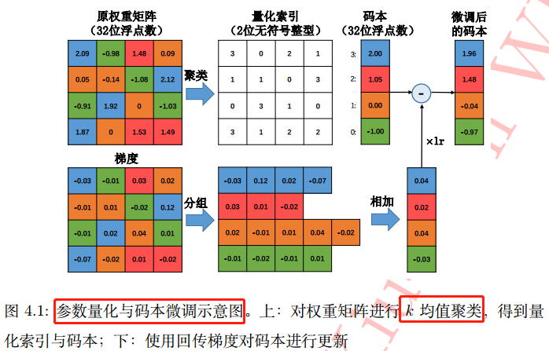

## 神经网络的压缩方法
+ 低秩近似
+ 剪枝与稀疏约束
+ 参数量化
+ 二值网络
+ 知识蒸馏
+ 紧凑的网络结构

我们知道，在一定程度上，网络越深，参数越多，模型越复杂，其最终效果越好。神经网络的压缩算法是，旨在将一个庞大而复杂的预训练模型（pre-trained model）转化为一个精简的小模型。
按照压缩过程对网络结构的破坏程度，我们将模型压缩技术分为“前端压缩”和“后端压缩”两部分。
+ 前端压缩，是指在不改变原网络结构的压缩技术，主要包括`知识蒸馏`、紧凑的模型结构涉及以及`滤波器（filter）层面的剪枝`等；
+ 后端压缩，是指包括`低秩近似`、未加限制的剪枝、`参数量化`以及二值网络等，目标在于尽可能减少模型大小，会对原始网络结构造成极大程度的改造。

总结：前端压缩几乎不改变原有网络结构（仅仅只是在原模型基础上减少了网络的层数或者滤波器个数），后端压缩对网络结构有不可逆的大幅度改变，造成原有深度学习库、甚至硬件设备不兼容改变之后的网络。其维护成本很高。
## 低秩近似
简单理解就是，卷积神经网络的权重矩阵往往稠密且巨大，从而计算开销大，有一种办法是**采用低秩近似的技术**将该稠密矩阵由若干个小规模矩阵近似重构出来，这种方法归类为低秩近似算法。
> 一般地，行阶梯型矩阵的秩等于其“台阶数”-非零行的行数。

**低秩近似算法能减小计算开销的原理**如下：
给定权重矩阵 $W\epsilon R^{m*n}$ , 若能将其表示为若干个低秩矩阵的组合，即 $W=\sum_{i=1}^{n}\alpha_{i}M_{i}$ , 其中 $W\epsilon R^{m*n}$ 为低秩矩阵，其秩为 $r_{i}$ , 并满足 $r_{i}<<min(m,n)$ ，则其每一个低秩矩阵都可分解为小规模矩阵的乘积，$M_{i}=G_{i}H_{i}^{T}$ ，其中 $G_{i}\epsilon R^{m*r_{i}}$ ，$H_{i}\epsilon R^{m*r_{i}}$。当 $r_{i}$ 取值很小时，便能大幅降低总体的存储和计算开销。

基于以上想法，Sindhwani 等人提出使用结构化矩阵来进行低秩分解的算法，具体原理可自行参考论文。另一种比较简便的方法是使用矩阵分解来降低权重矩阵的参数，如 Denton 等人提出使用`奇异值分解`（Singular Value Decomposition，简称 SVD）分解来重构全连接层的权重。
### 总结
低秩近似算法在中小型网络模型上，取得了很不错的效果，但其超参数量与网络层数呈线性变化趋势，随着网络层数的增加与模型复杂度的提升，其搜索空间会急剧增大。
## 剪枝与稀疏约束
给定一个预训练好的网络模型，常用的剪枝算法一般都遵从如下操作：
1. 衡量神经元的重要程度
2. 移除掉一部分不重要的神经元，这步比前 1 步更加简便，灵活性更高
3. 对网络进行微调，剪枝操作不可避免地影响网络的精度，为防止对分类性能造成过大的破坏，需要对剪枝后的模型进行微调。对于大规模行图像数据集（如ImageNet）而言，微调会占用大量的计算资源，因此对网络微调到什么程度，是需要斟酌的
4. 返回第一步，循环进行下一轮剪枝

基于以上循环剪枝框架，不同学者提出了不同的方法，Han等人提出首先**将低于某个阈值的权重连接全部剪除**，之后对剪枝后的网络进行微调以完成参数更新的方法，这种方法的不足之处在于，剪枝后的网络是非结构化的，即被剪除的网络连接在分布上，没有任何连续性，这种稀疏的结构，导致CPU高速缓冲与内存频繁切换，从而限制了实际的加速效果。

基于此方法，有学者尝试将剪枝的粒度提升到整个滤波器级别，即丢弃整个滤波器，但是如何衡量滤波器的重要程度是一个问题，其中一种策略是基于滤波器权重本身的统计量，如分别计算每个滤波器的 L1 或 L2 值，将相应数值大小作为衡量重要程度标准。

**利用稀疏约束来对网络进行剪枝也是一个研究方向，其思路是在网络的优化目标中加入权重的稀疏正则项，使得训练时网络的部分权重趋向于 0 ，而这些 0 值就是剪枝的对象**。
### 总结
总体而言，剪枝是一项有效减小模型复杂度的通用压缩技术，其关键之处在于`如何衡量个别权重对于整体模型的重要程度`。剪枝操作对网络结构的破坏程度极小，将剪枝与其他后端压缩技术相结合，能够达到网络模型最大程度压缩。
## 参数量化
相比于剪枝操作，参数量化则是一种常用的后端压缩技术。所谓“量化”，是指从权重中归纳出若干“代表”，由这些“代表”来表示某一类权重的具体数值。“代表”被存储在码本（codebook）之中，而原权重矩阵只需记录各自“代表”的索引即可，从而**极大地降低了存储开销**。这种思想可类比于经典的词包模型（bag-of-words model）。常用量化算法如下：

1. 标量量化（`scalar quantization`）。
2. 标量量化会在一定程度上降低网络的精度，为避免这个弊端，很多算法考虑结构化的向量方法，其中一种是乘积向量`（Product Quantization, PQ）`，详情咨询查阅论文。
3. 以PQ方法为基础，Wu等人设计了一种通用的网络量化算法：`QCNN(quantized CNN)`，主要思想在于Wu等人认为最小化每一层网络输出的重构误差，比最小化量化误差更有效。
   
标量量化算法基本思路是，对于每一个权重矩阵$W\epsilon R^{1*mn}$，首先将其转化为向量形式：$w\epsilon R^{1*mn}$。之后对该权重向量的元素进行 $k$ 个簇的聚类，这可借助于经典的 `k-均值（k-means）聚类`算法快速完成：
$$\underset{c}{arg min}\sum_{i}^{mn}\sum_{j}^{k}\begin{Vmatrix}​
w_{i}-c_{j}
\end{Vmatrix}_{2}^{2}$$

这样，只需将 $k$ 个聚类中心（$c_{j}$，标量）存储在码本中，而原权重矩阵则只负责记录各自聚类中心在码本中索引。如果不考虑码本的存储开销，该算法能将存储空间减少为原来的 $log_{2}(k)/32$。基于 $k$ 均值算法的标量量化在很多应用中非常有效。参数量化与码本微调过程图如下：



这三类基于聚类的参数量化算法，其本质思想在于将多个权重映射到同一个数值，从而实现权重共享，降低存储开销的目的。
### 总结
参数量化是一种常用的后端压缩技术，能够以很小的性能损失实现模型体积的大幅下降，不足之处在于，量化的网络是“固定”的，很难对其做任何改变，同时这种方法通用性差，需要配套专门的深度学习库来运行网络。
## 二值化网络
1. 二值化网络可以视为量化方法的一种极端情况：所有的权重参数取值只能为 $\pm 1$ ，也就是使用 `1bit`来存储`Weight` 和 `Feature`。在普通神经网络中，一个参数是由单精度浮点数来表示的，参数的二值化能将存储开销降低为原来的 `1/32`。
2. 二值化神经网络以其高的模型压缩率和在前传中计算速度上的优势，近几年格外受到重视和发展，成为神经网络模型研究中的非常热门的一个研究方向。但是，第一篇真正意义上将神经网络中的权重值和激活函数值同时做到二值化的是 `Courbariaux` 等人 2016 年发表的名为《Binarynet: Training deep neural networks with weights and activations constrained to +1 or -1》的一篇论文。**这篇论文第一次给出了关于如何对网络进行二值化和如何训练二值化神经网络的方法**。
3. CNN 网络一个典型的模块是由卷积(`Conv`)->批标准化(`BNorm`)->激活(`Activ`)->池化(`Pool`)这样的顺序操作组成的。对于异或神经网络，设计出的模块是由批标准化(`BNorm`)->**二值化激活(BinActiv)**->二值化卷积(`BinConv`)->池化(`Pool`)的顺序操作完成。这样做的原因是批标准化以后，保证了输入均值为 `0`，然后进行二值化激活，保证了数据为 `-1` 或者 `+1`，然后进行二值化卷积，这样能最大程度上减少特征信息的损失。二值化残差网络结构定义实例代码如下：

```pyhon
def residual_unit(data, num_filter, stride, dim_match, num_bits=1):
    """残差块 Residual Block 定义
    """
    bnAct1 = bnn.BatchNorm(data=data, num_bits=num_bits)
    conv1 = bnn.Convolution(data=bnAct1, num_filter=num_filter, kernel=(3, 3), stride=stride, pad=(1, 1))
    convBn1 = bnn.BatchNorm(data=conv1, num_bits=num_bits)
    conv2 = bnn.Convolution(data=convBn1, num_filter=num_filter, kernel=(3, 3), stride=(1, 1), pad=(1, 1))
    if dim_match:
        shortcut = data
    else:
        shortcut = bnn.Convolution(data=bnAct1, num_filter=num_filter, kernel=(3, 3), stride=stride, pad=(1, 1))
    return conv2 + shortcut
```
### 二值网络的梯度下降
现在的神经网络几乎都是基于梯度下降算法来训练的，但是二值网络的权重只有 $\pm 1$，无法直接计算梯度信息，也无法进行权重更新。为解决这个问题，[Courbariaux](https://arxiv.org/pdf/1602.02830v1.pdf) 等人提出二值连接（binary connect）算法，该算法采取单精度与二值结合的方式来训练二值神经网络（），这是第一次给出了关于如何对网络进行二值化和如何训练二值化神经网络的方法。过程如下：
1. 权重 `weight` 初始化为浮点
2. 前向传播 `Forward Pass`:
    + 利用决定化方式（`sign(x)函数`）把 Weight 量化为 `+1/-1`, 以0为阈值
    + 利用量化后的 Weight (只有+1/-1)来计算前向传播，由二值权重与输入进行卷积运算（实际上只涉及加法），获得卷积层输出。
3. 反向传播 `Backward Pass`:
    + 把梯度更新到浮点的 Weight 上（根据放松后的符号函数，计算相应梯度值，并根据该梯度的值对单精度的权重进行参数更新）
    + 训练结束： 把 Weight 永久性转化为 `+1/-1`, 以便 `inference` 使用
### 两个问题
网络二值化需要解决两个问题：如何对权重进行二值化和如何计算二值权重的梯度。

**1，如何对权重进行二值化？**

权重二值化一般有两种选择：
+ 直接根据权重的正负进行二值化：$x^{b}=sign(x)$。符号函数 `sign(x)` 定义如下：
$$
sign(x) = \left \{\begin{matrix}
-1 & x < 0 \\ 
0 & x = 0 \\ 
1 & x > 0
\end{matrix}\right.
$$
公式.png)
+ 进行随机的二值化，即对每一个权重，以一定概率取 $\pm 1$

**2，如何计算二值权重的梯度？**

二值权重的梯度为0，无法进行参数更新。为解决这个问题，需要**对符号函数进行放松**，即用 $Htanh(x) = max(-1, min(1,x))$ 来代替 $sinx(x)$。当 x 在区间 [-1,1] 时，存在梯度值 1，否则梯度为 0 。
### 二值连接算法改进
之前的二值连接算法只对权重进行了二值化，但是网络的中间输出值依然是单精度的，于是 Rastegari 等人对此进行了改进，提出用**单精度对角阵与二值矩阵之积来近似表示原矩阵的算法**，以提升二值网络的分类性能，弥补二值网络在精度上弱势。该算法将原卷积运算分解为如下过程：
$$I*W\approx (I*B)\alpha$$

其中 $I\epsilon \mathbb{R}^{c\times w_{in}\times h_{in}}$ 为该层的输入张量，$I \epsilon \mathbb{R}^{c\times w\times h}$ 为该层的一个滤波器，$B=sign(W)\epsilon \{+1, -1\}^{c \times w\times h}$为该滤波器所对应的二值权重。

这里，Rastegari 等人认为单靠二值运算，很难达到原单精度卷积元素的结果，于是他们使用了一个单精度放缩因子 $\alpha \epsilon \mathbb{R}^{+}$ 来对二值滤波器卷积后的结果进行放缩。而$\alpha$ 的取值，则可根据优化目标： 
$$min \left \|| W -\alpha B \right \||^{2}$$

得到$\alpha = \frac{1}{n}\left \|| W \right \||_{\iota _{1}}$。二值连接改进的算法训练过程与之前的算法大致相同，不同的地方在于梯度的计算过程还考虑了 $\alpha$ 的影响。由于  $\alpha$ 这个单精度的缩放因子的存在，有效降低了重构误差，并首次在 ImageNet 数据集上取得了与 Alex-Net 相当的精度。如下图所示：


可以看到的是`权重二值化神经网络（BWN）`和全精度神经网络的精确度几乎一样，但是与异或神经网络（XNOR-Net）相比而言，Top-1 和 Top-5 都有 10+% 的损失。
> 相比于权重二值化神经网络，异或神经网络将网络的输入也转化为二进制值，所以，异或神经网络中的乘法加法 (Multiplication and ACcumulation) 运算用按位异或 (bitwise xnor) 和数 1 的个数 (popcount) 来代替。

**更多内容，可以看这两篇文章：**
+ [https://github.com/Ewenwan/MVision/tree/master/CNN/Deep_Compression/quantization/BNN](https://github.com/Ewenwan/MVision/tree/master/CNN/Deep_Compression/quantization/BNN)
+ [二值神经网络（Binary Neural Network，BNN）](https://blog.csdn.net/stdcoutzyx/article/details/50926174)
### 二值网络设计注意事项
+ 不要使用 kernel = (1, 1) 的 `Convolution` （包括 resnet 的 bottleneck）：二值网络中的 weight 都为 1bit， 如果再是 1x1 大小， 会极大地降低表达能力
+ 增大 `Channel` 数目 + 增大 activation bit 数 要协同配合：如果一味增大 channel 数， 最终 feature map 因为 bit 数过低， 还是浪费了模型容量。 同理反过来也是。
+ 建议使用 4bit 及以下的 `activation bit`， 过高带来的精度收益变小， 而会显著提高 inference 计算量
## 知识蒸馏
知识蒸馏（knowledge distillation），是迁移学习（transfer learning）的一种，简单来说就是训练一个大模型（teacher）和一个小模型（student），将庞大而复杂的大模型学习到的知识，通过一定技术手段迁移到精简的小模型上，从而使小模型能够获得与大模型相近的性能。
student模型最终的损失函数由两部分组成：
+ 第一项是由小模型的预测结果与大模型的“软标签”所构成的交叉熵（cross entroy）;
+ 第二项为预测结果与普通类别标签的交叉熵。

软标签计算公式：$$q_{i} = \frac{z_{i}/T}{\sum_{j}z_{j}/T}$$

这两个损失函数的重要程度可通过一定的权重进行调节，在实际应用中， `T` 的取值会影响最终的结果，一般而言，较大的 T 能够获得较高的准确度，T（蒸馏温度参数） 属于知识蒸馏模型训练超参数的一种。**T是一个可调节的超参数、T值越大、概率分布越软（论文中的描述），曲线便越平滑**，相当于在迁移学习的过程中添加了扰动，从而使得学生网络在借鉴学习的时候更有效、泛化能力更强，这其实就是一种抑制过拟合的策略。知识蒸馏的整个过程如下图：


`student` 模型的实际模型结构和小模型一样，但是损失函数包含了两部分，`mxnet` 代码示例如下：
```Pyhon
def get_symbol(data, class_labels, resnet_layer_num,Temperature,mimic_weight,num_classes=2):
    conv1 = ConvFactory(data, 48, kernel=(3, 3), stride=(2, 2), pad=(1, 1), name="conv1_3x3")
    conv2 = InceptionFactoryB(conv1, 10, 12, 10, 12, 16, (1,1),'conv2_block')
    conv3 = InceptionFactoryB(conv2, 12, 24, 12, 24, 24, (0,0),'conv3_block')
    conv4 = InceptionFactoryC(conv3, 24, 96, 96, (0,0),(2,2),'max','conv4_block')
    conv5 = InceptionFactoryC(conv4, 72, 288, 288, (0,0),(1,1),'avg','con5_block')
    flatten = mx.symbol.Flatten(data=conv5, name="flatten")
    fc_class_score_s = mx.symbol.FullyConnected(data=flatten, num_hidden=num_classes, name='fc_class_score')
    softmax1 = mx.symbol.SoftmaxOutput(data=fc_class_score_s, label=class_labels, name='softmax_hard')

    import symbol_resnet
    fc_class_score_t = symbol_resnet.get_symbol(net_depth=resnet_layer_num, num_class=num_classes,data=data)
    s_input_for_softmax=fc_class_score_s/Temperature
    t_input_for_softmax=fc_class_score_t/Temperature
    t_soft_labels=mx.symbol.softmax(t_input_for_softmax,name='teacher_soft_labels')
    softmax2 = mx.symbol.SoftmaxOutput(data=s_input_for_softmax, label=t_soft_labels, name='softmax_soft',grad_scale=mimic_weight)
    group=mx.symbol.Group([softmax1,softmax2])
    group.save('group2-symbol.json')
    return group
```
`tensorflow`代码示例如下：
```Python
# 将类别标签进行one-hot编码
one_hot = tf.one_hot(y, n_classes,1.0,0.0) # n_classes为类别总数, n为类别标签
#one_hot = tf.cast(one_hot_int, tf.float32)
teacher_tau = tf.scalar_mul(1.0/args.tau, teacher) # teacher为teacher模型直接输出张量, tau为温度系数T
student_tau = tf.scalar_mul(1.0/args.tau, student) # 将模型直接输出logits张量student处于温度系数T
objective1 = tf.nn.sigmoid_cross_entropy_with_logits(student_tau, one_hot)
objective2 = tf.scalar_mul(0.5, tf.square(student_tau-teacher_tau))
# student模型最终的损失函数由两部分组成：
# 第一项是由小模型的预测结果与大模型的“软标签”所构成的交叉熵（cross entroy）;
# 第二项为预测结果与普通类别标签的交叉熵。
tf_loss = (args.lamda*tf.reduce_sum(objective1) + (1-args.lamda)*tf.reduce_sum(objective2))/batch_size
```
`tf.scalar_mul` 函数为对 `tf` 张量进行固定倍率 `scalar` 缩放函数。**一般 T 的取值在 1 - 20 之间，这里我参考了开源代码，取值为 3**。我发现在开源代码中 `student` 模型的训练，有些是和 `teacher` 模型一起训练的，有些是 teacher 模型训练好后直接指导 student 模型训练。
## 浅层网络
浅层网络：通过设计一个更浅（层数较少）结构更紧凑的网络来实现对复杂模型效果的逼近, 但是浅层网络的表达能力很难与深层网络相匹敌。因此，这种设计方法的局限性在于只能应用解决在较为简单问题上。如分类问题中类别数较少的 task。
## 参考资料
1. [神经网络模型压缩和加速之知识蒸馏](https://www.cnblogs.com/dyl222/p/11079489.html)
2. [https://github.com/chengshengchan/model_compression/blob/master/teacher-student.py](https://github.com/chengshengchan/model_compression/blob/master/teacher-student.py)
3. [https://github.com/dkozlov/awesome-knowledge-distillation](https://github.com/dkozlov/awesome-knowledge-distillation)
4. [XNOR-Net](https://arxiv.org/abs/1603.05279])
5. 解析卷积神经网络-深度学习实践手册
