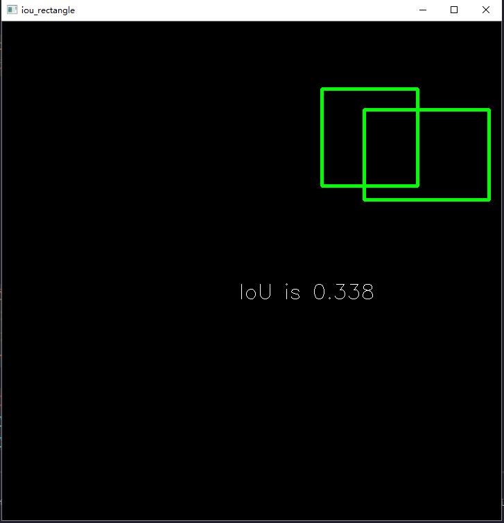
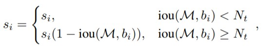
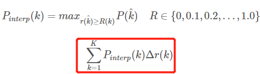
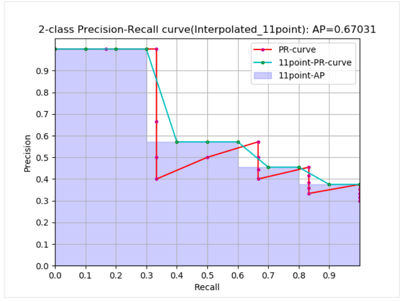
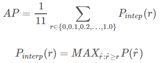

## 前言
**不同的问题和不同的数据集都会有不同的模型评价指标，比如分类问题，数据集类别平衡的情况下可以使用准确率作为评价指标，但是现实中的数据集几乎都是类别不平衡的，所以一般都是采用 `AP` 作为评价指标，分别计算每个类别的 `AP`，再计算`mAP`**。
## anchors
所谓 `anchors`，实际上就是一组由 generate_anchors.py 生成的矩形框。其中每行的4个值 `(x1,y1,x2,y2)` 表矩形左上和右下角点坐标。9个矩形共有3种形状，长宽比为大约为 `{1:1, 1:2, 2:1}` 三种, 实际上通过anchors就引入了检测中常用到的多尺度方法。generate_anchors.py的代码如下：
```Python
import numpy as np
import six
from six import __init__  # 兼容python2和python3模块


def generate_anchor_base(base_size=16, ratios=[0.5, 1, 2],
                         anchor_scales=[8, 16, 32]):
    """Generate anchor base windows by enumerating aspect ratio and scales.

    Generate anchors that are scaled and modified to the given aspect ratios.
    Area of a scaled anchor is preserved when modifying to the given aspect
    ratio.

    :obj:`R = len(ratios) * len(anchor_scales)` anchors are generated by this
    function.
    The :obj:`i * len(anchor_scales) + j` th anchor corresponds to an anchor
    generated by :obj:`ratios[i]` and :obj:`anchor_scales[j]`.

    For example, if the scale is :math:`8` and the ratio is :math:`0.25`,
    the width and the height of the base window will be stretched by :math:`8`.
    For modifying the anchor to the given aspect ratio,
    the height is halved and the width is doubled.

    Args:
        base_size (number): The width and the height of the reference window.
        ratios (list of floats): This is ratios of width to height of
            the anchors.
        anchor_scales (list of numbers): This is areas of anchors.
            Those areas will be the product of the square of an element in
            :obj:`anchor_scales` and the original area of the reference
            window.

    Returns:
        ~numpy.ndarray:
        An array of shape :math:`(R, 4)`.
        Each element is a set of coordinates of a bounding box.
        The second axis corresponds to
        :math:`(x_{min}, y_{min}, x_{max}, y_{max})` of a bounding box.

    """
    import numpy as np
    py = base_size / 2.
    px = base_size / 2.

    anchor_base = np.zeros((len(ratios) * len(anchor_scales), 4),
                           dtype=np.float32)
    for i in six.moves.range(len(ratios)):
        for j in six.moves.range(len(anchor_scales)):
            h = base_size * anchor_scales[j] * np.sqrt(ratios[i])
            w = base_size * anchor_scales[j] * np.sqrt(1. / ratios[i])

            index = i * len(anchor_scales) + j
            anchor_base[index, 0] = px - w / 2.
            anchor_base[index, 1] = py - h / 2.

            anchor_base[index, 2] = px + h / 2.
            anchor_base[index, 3] = py + w / 2.
    return anchor_base


# test
if __name__ == "__main__":
    bbox_list = generate_anchor_base()
    print(bbox_list)
```
程序运行输出如下：
> [[ -82.50967   -37.254833   53.254833   98.50967 ]
 [-173.01933   -82.50967    98.50967   189.01933 ]
 [-354.03867  -173.01933   189.01933   370.03867 ]
 [ -56.        -56.         72.         72.      ]
 [-120.       -120.        136.        136.      ]
 [-248.       -248.        264.        264.      ]
 [ -37.254833  -82.50967    98.50967    53.254833]
 [ -82.50967  -173.01933   189.01933    98.50967 ]
 [-173.01933  -354.03867   370.03867   189.01933 ]]
## 交并比IOU
交并比（Intersection-over-Union，IoU），目标检测中使用的一个概念，是产生的候选框（candidate bound）与原标记框（ground truth bound）的交叠率，即它们的交集与并集的比值。最理想情况是完全重叠，即比值为1。
计算公式如下：


代码实现如下：
```python
# _*_ coding:utf-8 _*_
# 计算iou

"""
bbox的数据结构为(xmin,ymin,xmax,ymax)--(x1,y1,x2,y2),
每个bounding box的左上角和右下角的坐标
输入：
    bbox1, bbox2
输出：
    iou值
"""
import numpy as np
import cv2

def iou(bbox1, bbox2):
    """
    计算两个bbox(两框的交并比)的iou值
    :param bbox1: (x1,y1,x2,y2), type: ndarray or list
    :param bbox2: (x1,y1,x2,y2), type: ndarray or list
    :return: iou, type float
    """
    if type(bbox1) or type(bbox2) != 'ndarray':
        bbox1 = np.array(bbox1)
        bbox2 = np.array(bbox2)

    assert bbox1.size == 4 and bbox2.size == 4, "bounding box coordinate size must be 4"
    xx1 = np.max((bbox1[0], bbox2[0]))
    yy1 = np.max((bbox1[1], bbox1[1]))
    xx2 = np.min((bbox1[2], bbox2[2]))
    yy2 = np.min((bbox1[3], bbox2[3]))
    bwidth = xx2 - xx1
    bheight = yy2 - yy1
    area = bwidth * bheight  # 求两个矩形框的交集
    union = (bbox1[2] - bbox1[0])*(bbox1[3] - bbox1[1]) + (bbox2[2] - bbox2[0])*(bbox2[3] - bbox2[1]) - area  # 求两个矩形框的并集
    iou = area / union

    return iou


if __name__=='__main__':
    rect1 = (461, 97, 599, 237)
    # (top, left, bottom, right)
    rect2 = (522, 127, 702, 257)
    iou_ret = round(iou(rect1, rect2), 3) # 保留3位小数
    print(iou_ret)

    # Create a black image
    img=np.zeros((720,720,3), np.uint8)
    cv2.namedWindow('iou_rectangle')
    """
    cv2.rectangle 的 pt1 和 pt2 参数分别代表矩形的左上角和右下角两个点,
    coordinates for the bounding box vertices need to be integers if they are in a tuple,
    and they need to be in the order of (left, top) and (right, bottom). 
    Or, equivalently, (xmin, ymin) and (xmax, ymax).
    """
    cv2.rectangle(img,(461, 97),(599, 237),(0,255,0),3)
    cv2.rectangle(img,(522, 127),(702, 257),(0,255,0),3)
    font  = cv2.FONT_HERSHEY_SIMPLEX
    cv2.putText(img, 'IoU is ' + str(iou_ret), (341,400), font, 1,(255,255,255),1)
    cv2.imshow('iou_rectangle', img)
    cv2.waitKey(0)
```
代码输出结果如下所示：



## 非极大值抑制算法NMS
### [NMS介绍](https://juejin.im/entry/5bdbc26151882516da0ddd25)
在目标检测中，常会利用非极大值抑制算法(NMS，non maximum suppression)对生成的大量候选框进行后处理，去除冗余的候选框，得到最佳检测框，以加快目标检测的效率。其本质思想是其思想是搜素局部最大值，抑制非极大值。非极大值抑制，在计算机视觉任务中得到了广泛的应用，例如边缘检测、人脸检测、目标检测（DPM，YOLO，SSD，Faster R-CNN）等。即如图 2所示实现效果，消除多余的候选框，找到最佳的bbox。`NMS过程`如下图所示：


以上图为例，每个选出来的Bounding Box检测框（既BBox）用（x,y,h,w, confidence score，Pdog,Pcat）表示，confidence score表示background和foreground的置信度得分，取值范围[0,1]。Pdog,Pcat分布代表类别是狗和猫的概率。如果是100类的目标检测模型，BBox输出向量为5+100=105。
### [NMS算法](https://juejin.im/entry/5bdbc26151882516da0ddd25)
NMS主要就是通过迭代的形式，不断地以最大得分的框去与其他框做IoU操作，并过滤那些IoU较大的框。
其实现的思想主要是将各个框的置信度进行排序，然后选择其中置信度最高的框A，将其作为标准选择其他框，同时设置一个阈值，[当其他框B与A的重合程度超过阈值就将B舍弃掉](https://blog.csdn.net/williamyi96/article/details/77996167 )，然后在剩余的框中选择置信度最大的框，重复上述操作。算法过程如下：
1. 根据候选框类别分类概率排序：F>E>D>C>B>A，并标记最大概率的矩形框F作为标准框。
2. 分别判断A~E与F的重叠度IOU(两框的交并比)是否大于某个设定的阈值，假设B、D与F的重叠度超过阈值，那么就扔掉B、D；
3. 从剩下的矩形框A、C、E中，选择概率最大的E，标记为要保留下来的，然后判读E与A、C的重叠度，扔掉重叠度超过设定阈值的矩形框；
4. 对剩下的bbx，循环执行(2)和(3)直到所有的bbx均满足要求（即不能再移除bbx）

**nms的python代码如下**：
```Python
import numpy as np

def py_nms(dets, thresh):
    """Pure Python NMS baseline.注意，这里的计算都是在矩阵层面上计算的
    greedily select boxes with high confidence and overlap with current maximum <= thresh
    rule out overlap >= thresh
    :param dets: [[x1, y1, x2, y2 score],] # ndarray, shape(-1,5)
    :param thresh: retain overlap < thresh
    :return: indexes to keep
    """
    # x1、y1、x2、y2、以及score赋值
    x1 = dets[:, 0]
    y1 = dets[:, 1]
    x2 = dets[:, 2]
    y2 = dets[:, 3]

    # 计算每一个候选框的面积, 纯矩阵加和乘法运算,为何加1？
    areas = (x2 - x1 + 1) * (y2 - y1 + 1)
    # order是将confidence降序排序后得到的矩阵索引
    order = np.argsort(dets[:, 4])[::-1]
    keep = []
    while order.size > 0:
        i = order[0]
        keep.append(i)
        # 计算当前概率最大矩形框与其他矩形框的相交框的坐标，会用到numpy的broadcast机制，得到的是向量
        xx1 = np.maximum(x1[i], x1[order[1:]])
        yy1 = np.maximum(y1[i], y1[order[1:]])
        xx2 = np.minimum(x2[i], x2[order[1:]])
        yy2 = np.minimum(y2[i], y2[order[1:]])

        # 计算相交框的面积,注意矩形框不相交时w或h算出来会是负数，用0代替
        w = np.maximum(0.0, xx2 - xx1 + 1)
        h = np.maximum(0.0, yy2 - yy1 + 1)
        inter = w * h
        # 计算重叠度IOU：重叠面积/（面积1+面积2-重叠面积）
        iou = inter / (areas[i] + areas[order[1:]] - inter)
        # 找到重叠度不高于阈值的矩形框索引
        inds = np.where(iou < thresh)[0]
        # 将order序列更新，由于前面得到的矩形框索引要比矩形框在原order序列中的索引小1，所以要把这个1加回来
        order = order[inds + 1]
    return keep

# test
if __name__ == "__main__":
    dets = np.array([[30, 20, 230, 200, 1],
                     [50, 50, 260, 220, 0.9],
                     [210, 30, 420, 5, 0.8],
                     [430, 280, 460, 360, 0.7]])
    thresh = 0.35
    keep_dets = py_nms(dets, thresh)
    print(keep_dets)
    print(dets[keep_dets])
```
程序输出如下：
> [0, 2, 3]
[[ 30. 20. 230. 200. 1. ]
 [210. 30. 420. 5. 0.8]
 [430. 280. 460. 360. 0.7]]

## Soft NMS算法
Soft NMS算法是对NMS算法的改进，是发表在ICCV2017的文章中提出的。`NMS`算法存在一个问题是可能会把一些目标框给过滤掉，从而导致目标的`recall`指标比较低。原来的NMS可以描述如下：将IOU大于阈值的窗口的得分全部置为0，计算公式如下：


文章的改进有两种形式，一种是`线性加权`的。设 si 为第 i 个 box 的 score, 则在应用 SoftNMS 时各个 box score 的计算公式如下：



另一种是`高斯加权`的，高斯惩罚系数(与上面的线性截断惩罚不同的是, 高斯惩罚会对其他所有的 box 作用)，计算公式图如下：


注意，这两种形式，思想都是M为当前得分最高框，$b_{i}$为待处理框， $b_{i}$和M的IOU越大，bbox的得分$s_{i}$就下降的越厉害($N_{t}$为给定阈值)。更多细节可以参考原[论文](https://arxiv.org/pdf/1704.04503.pdf)
soft nms的python代码如下：
```Python
def soft_nms(dets, thresh, type='gaussian'):
    x1 = dets[:, 0]
    y1 = dets[:, 1]
    x2 = dets[:, 2]
    y2 = dets[:, 3]
    scores = dets[:, 4]

    areas = (x2 - x1 + 1) * (y2 - y1 + 1)
    order = scores.argsort()[::-1]
    scores = scores[order]

    keep = []
    while order.size > 0:
        i = order[0]
        dets[i, 4] = scores[0]
        keep.append(i)

        xx1 = np.maximum(x1[i], x1[order[1:]])
        yy1 = np.maximum(y1[i], y1[order[1:]])
        xx2 = np.minimum(x2[i], x2[order[1:]])
        yy2 = np.minimum(y2[i], y2[order[1:]])

        w = np.maximum(0.0, xx2 - xx1 + 1)
        h = np.maximum(0.0, yy2 - yy1 + 1)
        inter = w * h
        # 计算重叠度IOU：重叠面积/（面积1+面积2-重叠面积）
        ovr = inter / (areas[i] + areas[order[1:]] - inter)

        order = order[1:]
        scores = scores[1:]
        if type == 'linear':
            inds = np.where(ovr >= thresh)[0]
            scores[inds] *= (1 - ovr[inds])
        else:
            scores *= np.exp(- ovr ** 2 / thresh)
        inds = np.where(scores > 1e-3)[0]
        order = order[inds]
        scores = scores[inds]

        tmp = scores.argsort()[::-1]
        order = order[tmp]
        scores = scores[tmp]
    return keep
```
## 类别AP计算
目标检测领域常用的评估标准是：`mAP(mean average precision)`，计算mAP需要先计算`AP`，计算`AP`需涉及到`precision`和`recall`的计算，而这两者的计算又需设计`TP`、`FP`、`FN`的计算。
`AP`的计算一般先涉及到`P-R`曲线（precision-recall curve）的绘制，P-R曲线下面与x轴围成的面积称为`average precison（AP）`。下图是一个二分类问题的P-R曲线：


### 近似计算AP(approximated average precision)
$$AP = \sum_{k=1}^{N}P(k)\Delta r(k)$$
+ 这个计算方式称为 approximated 形式的，而插值计算的方式里面这个是最精确的，每个样本点都参与了计算；
+ 很显然位于一条竖直线上的点对计算AP没有贡献；
+ 这里 `N` 为数据总量，`k` 为每个样本点的索引， $Δr(k)=r(k)−r(k−1)$。

**近似计算**`AP`和绘制·PR`曲线代码如下：
```Python
import numpy as np
import matplotlib.pyplot as plt

class_names = ["car", "pedestrians", "bicycle"]

def draw_PR_curve(predict_scores, eval_labels, name, cls_idx=1):
    """calculate AP and draw PR curve, there are 3 types
    Parameters:
    @all_scores: single test dataset predict scores array, (-1, 3)
    @all_labels: single test dataset predict label array, (-1, 3)
    @cls_idx: the serial number of the AP to be calculated, example: 0,1,2,3...
    """
    # print('sklearn Macro-F1-Score:', f1_score(predict_scores, eval_labels, average='macro'))
    global class_names
    fig, ax = plt.subplots(nrows=1, ncols=1, figsize=(15, 10))
    # Rank the predicted scores from large to small, extract their corresponding index(index number), and generate an array
    idx = predict_scores[:, cls_idx].argsort()[::-1]
    eval_labels_descend = eval_labels[idx]
    pos_gt_num = np.sum(eval_labels == cls_idx) # number of all gt

    predict_results = np.ones_like(eval_labels)
    tp_arr = np.logical_and(predict_results == cls_idx, eval_labels_descend == cls_idx) # ndarray
    fp_arr = np.logical_and(predict_results == cls_idx, eval_labels_descend != cls_idx)

    tp_cum = np.cumsum(tp_arr).astype(float) # ndarray, Cumulative sum of array elements.
    fp_cum = np.cumsum(fp_arr).astype(float)

    precision_arr = tp_cum / (tp_cum + fp_cum) # ndarray
    recall_arr = tp_cum / pos_gt_num
    ap = 0.0
    prev_recall = 0
    for p, r in zip(precision_arr, recall_arr):
      ap += p * (r - prev_recall)
      # pdb.set_trace()
      prev_recall = r
    print("------%s, ap: %f-----" % (name, ap))

    fig_label = '[%s, %s] ap=%f' % (name, class_names[cls_idx], ap)
    ax.plot(recall_arr, precision_arr, label=fig_label)

    ax.legend(loc="lower left")
    ax.set_title("PR curve about class: %s" % (class_names[cls_idx]))
    ax.set(xticks=np.arange(0., 1, 0.05), yticks=np.arange(0., 1, 0.05))
    ax.set(xlabel="recall", ylabel="precision", xlim=[0, 1], ylim=[0, 1])

    fig.savefig("./pr-curve-%s.png" % class_names[cls_idx])
    plt.close(fig)
```

### 插值计算(Interpolated average precision)
插值计算AP的公式的演变过程我不写了，详情可以参考这篇[文章](https://arleyzhang.github.io/articles/c521a01c/)，我这里的公式和图也是参考此文章的。`11点插值计算方式计算AP公式`如下：



+ 这是通常意义上的 11points_Interpolated 形式的 AP，选取固定的 {0,0.1,0.2,…,1.0} 11个阈值，这个在PASCAL2007中有使用
+ 这里因为参与计算的只有11个点，所以 K=11，称为11points_Interpolated，k为阈值索引
+ $P_{interp}(k)$ 取第 k 个阈值所对应的样本点之后的样本中的最大值，只不过这里的阈值被限定在了 {0,0.1,0.2,…,1.0} 范围内。




从曲线上看，真实 `AP< approximated AP < Interpolated AP`，11-points Interpolated AP 可能大也可能小，当数据量很多的时候会接近于 Interpolated AP，与 Interpolated AP不同，前面的公式中计算AP时都是对PR曲线的面积估计，PASCAL的论文里给出的公式就更加简单粗暴了，直接计算11个阈值处的precision的平均值。如下：



### AP计算代码实现

### 不同数据集map计算方法
由于 mAP 是数据集中所有类别 AP 值得平均，所以我们要计算mAP，首先得知道某一类别的AP值怎么求。不同数据集的某类别的AP计算方法大同小异，主要分为三种：

（1）在 `VOC2007`，只需要选取当Recall >= 0, 0.1, 0.2, ..., 1共11个点时的Precision最大值，然后AP就是这11个Precision的平均值，map就是所有类别AP值的平均。

（2）在 `VOC2010` 及以后，需要针对每一个不同的Recall值（包括0和1），选取其大于等于这些Recall值时的Precision最大值，然后计算PR曲线下面积作为AP值，map就是所有类别AP值的平均。

（3）COCO 数据集，设定多个IOU阈值（0.5-0.95,0.05为步长），在每一个IOU阈值下都有某一类别的AP值，然后求不同IOU阈值下的AP平均，就是所求的最终的某类别的AP值。

`VOC` 数据集中计算 `AP` 的代码（用的是插值计算方法，代码出自[py-faster-rcnn仓库](https://github.com/rbgirshick/py-faster-rcnn/blob/master/lib/datasets/voc_eval.py)）如下：

1, 在给定 `recal` 和 `precision` 的条件下计算AP：
```Python
def voc_ap(rec, prec, use_07_metric=False):
    """ 
    ap = voc_ap(rec, prec, [use_07_metric])
    Compute VOC AP given precision and recall.
    If use_07_metric is true, uses the
    VOC 07 11 point method (default:False).
    """
    if use_07_metric:
        # 11 point metric
        ap = 0.
        for t in np.arange(0., 1.1, 0.1):
            if np.sum(rec >= t) == 0:
                p = 0
            else:
                p = np.max(prec[rec >= t])
            ap = ap + p / 11.
    else:
        # correct AP calculation
        # first append sentinel values at the end
        mrec = np.concatenate(([0.], rec, [1.]))
        mpre = np.concatenate(([0.], prec, [0.]))

        # compute the precision envelope
        for i in range(mpre.size - 1, 0, -1):
            mpre[i - 1] = np.maximum(mpre[i - 1], mpre[i])

        # to calculate area under PR curve, look for points
        # where X axis (recall) changes value
        i = np.where(mrec[1:] != mrec[:-1])[0]

        # and sum (\Delta recall) * prec
        ap = np.sum((mrec[i + 1] - mrec[i]) * mpre[i + 1])
    return ap
```
**给定目标检测结果文件和测试集标签文件xml等计算AP**
```Python
def parse_rec(filename):
    """ Parse a PASCAL VOC xml file 
    Return : list, element is dict.
    """
    tree = ET.parse(filename)
    objects = []
    for obj in tree.findall('object'):
        obj_struct = {}
        obj_struct['name'] = obj.find('name').text
        obj_struct['pose'] = obj.find('pose').text
        obj_struct['truncated'] = int(obj.find('truncated').text)
        obj_struct['difficult'] = int(obj.find('difficult').text)
        bbox = obj.find('bndbox')
        obj_struct['bbox'] = [int(bbox.find('xmin').text),
                              int(bbox.find('ymin').text),
                              int(bbox.find('xmax').text),
                              int(bbox.find('ymax').text)]
        objects.append(obj_struct)

    return objects


def voc_eval(detpath,
             annopath,
             imagesetfile,
             classname,
             cachedir,
             ovthresh=0.5,
             use_07_metric=False):
    """rec, prec, ap = voc_eval(detpath,
                                annopath,
                                imagesetfile,
                                classname,
                                [ovthresh],
                                [use_07_metric])
    Top level function that does the PASCAL VOC evaluation.
    detpath: Path to detections result file
        detpath.format(classname) should produce the detection results file.
    annopath: Path to annotations file
        annopath.format(imagename) should be the xml annotations file.
    imagesetfile: Text file containing the list of images, one image per line.
    classname: Category name (duh)
    cachedir: Directory for caching the annotations
    [ovthresh]: Overlap threshold (default = 0.5)
    [use_07_metric]: Whether to use VOC07's 11 point AP computation
        (default False)
    """
    # assumes detections are in detpath.format(classname)
    # assumes annotations are in annopath.format(imagename)
    # assumes imagesetfile is a text file with each line an image name
    # cachedir caches the annotations in a pickle file

    # first load gt
    if not os.path.isdir(cachedir):
        os.mkdir(cachedir)
    cachefile = os.path.join(cachedir, '%s_annots.pkl' % imagesetfile)
    # read list of images
    with open(imagesetfile, 'r') as f:
        lines = f.readlines()
    imagenames = [x.strip() for x in lines]

    if not os.path.isfile(cachefile):
        # load annotations
        recs = {}
        for i, imagename in enumerate(imagenames):
            recs[imagename] = parse_rec(annopath.format(imagename))
            if i % 100 == 0:
                print('Reading annotation for {:d}/{:d}'.format(
                    i + 1, len(imagenames)))
        # save
        print('Saving cached annotations to {:s}'.format(cachefile))
        with open(cachefile, 'wb') as f:
            pickle.dump(recs, f)
    else:
        # load
        with open(cachefile, 'rb') as f:
            try:
                recs = pickle.load(f)
            except:
                recs = pickle.load(f, encoding='bytes')

    # extract gt objects for this class
    class_recs = {}
    npos = 0
    for imagename in imagenames:
        R = [obj for obj in recs[imagename] if obj['name'] == classname]
        bbox = np.array([x['bbox'] for x in R])
        difficult = np.array([x['difficult'] for x in R]).astype(np.bool)
        det = [False] * len(R)
        npos = npos + sum(~difficult)
        class_recs[imagename] = {'bbox': bbox,
                                 'difficult': difficult,
                                 'det': det}

    # read dets
    detfile = detpath.format(classname)
    with open(detfile, 'r') as f:
        lines = f.readlines()

    splitlines = [x.strip().split(' ') for x in lines]
    image_ids = [x[0] for x in splitlines]
    confidence = np.array([float(x[1]) for x in splitlines])
    BB = np.array([[float(z) for z in x[2:]] for x in splitlines])

    nd = len(image_ids)
    tp = np.zeros(nd)
    fp = np.zeros(nd)

    if BB.shape[0] > 0:
        # sort by confidence
        sorted_ind = np.argsort(-confidence)
        sorted_scores = np.sort(-confidence)
        BB = BB[sorted_ind, :]
        image_ids = [image_ids[x] for x in sorted_ind]

        # go down dets and mark TPs and FPs
        for d in range(nd):
            R = class_recs[image_ids[d]]
            bb = BB[d, :].astype(float)
            ovmax = -np.inf
            BBGT = R['bbox'].astype(float)

            if BBGT.size > 0:
                # compute overlaps
                # intersection
                ixmin = np.maximum(BBGT[:, 0], bb[0])
                iymin = np.maximum(BBGT[:, 1], bb[1])
                ixmax = np.minimum(BBGT[:, 2], bb[2])
                iymax = np.minimum(BBGT[:, 3], bb[3])
                iw = np.maximum(ixmax - ixmin + 1., 0.)
                ih = np.maximum(iymax - iymin + 1., 0.)
                inters = iw * ih

                # union
                uni = ((bb[2] - bb[0] + 1.) * (bb[3] - bb[1] + 1.) +
                       (BBGT[:, 2] - BBGT[:, 0] + 1.) *
                       (BBGT[:, 3] - BBGT[:, 1] + 1.) - inters)

                overlaps = inters / uni
                ovmax = np.max(overlaps)
                jmax = np.argmax(overlaps)

            if ovmax > ovthresh:
                if not R['difficult'][jmax]:
                    if not R['det'][jmax]:
                        tp[d] = 1.
                        R['det'][jmax] = 1
                    else:
                        fp[d] = 1.
            else:
                fp[d] = 1.

    # compute precision recall
    fp = np.cumsum(fp)
    tp = np.cumsum(tp)
    rec = tp / float(npos)
    # avoid divide by zero in case the first detection matches a difficult
    # ground truth
    prec = tp / np.maximum(tp + fp, np.finfo(np.float64).eps)
    ap = voc_ap(rec, prec, use_07_metric)

    return rec, prec, ap
```

## FLOPs计算
+ `FLOPs`：floating point operations 指的是浮点运算次数,**理解为计算量**，可以用来衡量算法/模型的复杂度。
+ `FLOPS`：（全部大写）,Floating-point Operations Per Second，每秒所执行的浮点运算次数，理解为计算速度,是一个衡量硬件性能的指标。
+ `MACC`：multiply-accumulate，乘法累加次数。

### 卷积层FLOPs计算
+ $FLOPs=(2*C_i*K*K-1)*H*W*C_o$（不考虑bias）
+ $FLOPs=(2*C_i*K*K)*H*W*C_o$（考虑bias）
+ $MACC=(C_i*K*K)*H*W*C_o$（考虑bias）

**$C_i$ 为输入特征图通道数，$K$ 为过滤器尺寸，$H,W,C_o$ 为输出特征图的高，宽和通道数**。`二维卷积过程`如下图所示：

> 二维卷积是一个相当简单的操作：从卷积核开始，这是一个小的权值矩阵。这个卷积核在 2 维输入数据上「滑动」，对当前输入的部分元素进行矩阵乘法，然后将结果汇为单个输出像素。


公式解释，参考[这里](https://zhuanlan.zhihu.com/p/70306015?utm_source=wechat_session&utm_medium=social&utm_oi=571954943427219456)，如下：

执行卷积操作后输出 $C_o$ 张输出特征图，每张特征图上有 HxW 个像素点，而这其中的每个像素点的值都是由过滤器与输入特征图卷积得到的，过滤器中有 $C_i*K*K$ 个点，每个点都要和输入特征图对应点作一次相乘操作（浮点操作数为 $C_i*K*K$），然后将这些过滤器和输入特征图对应点相乘所得的数相加起来（浮点操作数为 $C_i*K*K-1$，n个数相加，所需要的浮点操作数为 n-1），得到一个值，对应于一张输出特征图中的一个像素，输出特征图有 $C_o$ 张，故有 $C_o$ 个过滤器参与卷积运算。

所以卷积层的 $FLOPs=(2*C_{i}*K*K-1)*H*W*C_o$ 
($C_i$ 为输入特征图通道数，$K$ 为过滤器尺寸，$H, W, C_o$为输出特征图的高，宽和通道数)。

## 目标检测度量标准汇总

## 参考资料
+ [目标检测评价标准-AP mAP](https://Harleyzhang.github.io/articles/c521a01c/)
+ [目标检测的性能评价指标](https://zhuanlan.zhihu.com/p/70306015?utm_source=wechat_session&utm_medium=social&utm_oi=571954943427219456)
+ [Soft-NMS](https://hellozhaozheng.github.io/z_post/%E8%AE%A1%E7%AE%97%E6%9C%BA%E8%A7%86%E8%A7%89-SoftNMS-ICCV2017/)
+ [Recent Advances in Deep Learning for Object Detection](https://arxiv.org/abs/1908.03673v1)
+ [A Simple and Fast Implementation of Faster R-CNN](https://github.com/chenyuntc/simple-faster-rcnn-pytorch)
